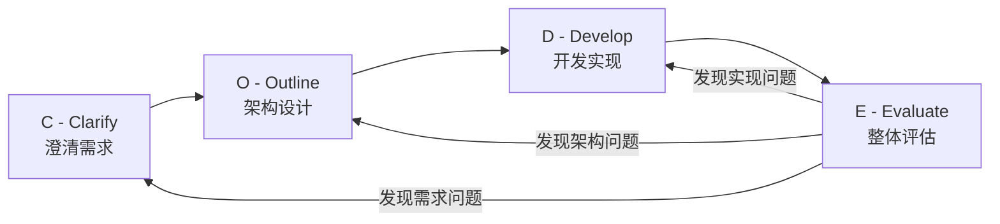
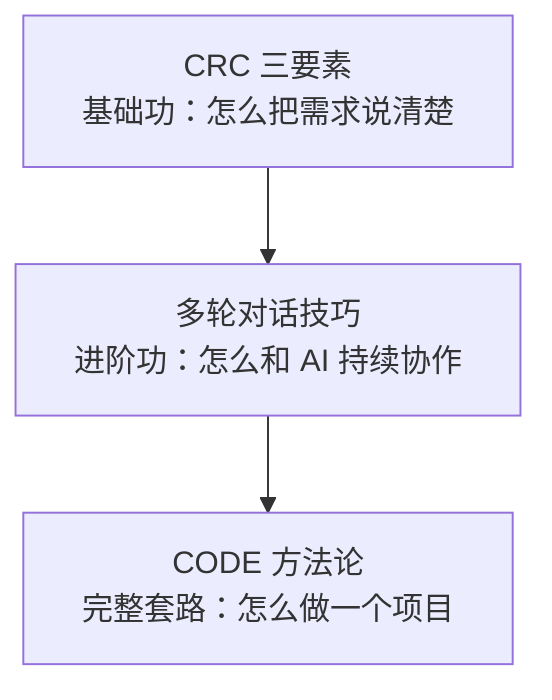

# 第三章：CODE 方法论概述

## 3.1 引言

**本章目标**：理解 CODE 方法论的全貌，建立对 AI 辅助项目开发的整体认知。

前两章我们学会了两个基本功：
- **CRC**：如何向 AI 清晰表达一个需求
- **多轮对话**：如何和 AI 持续协作解决问题

这两个技能足以应对日常的小任务——写个函数、改个 bug、查个问题。

但如果你要用 AI 做一个**完整的功能或项目**呢？比如从零开发一个 Todo 应用——有需求分析、架构设计、编码、测试、审查……这时候光会"写提示词"不够了，你需要一套**流程**来组织这些工作。

CODE 就是这样一套流程。它不是什么高深的理论，**本质上就是把"做项目的常识"整理成了四个步骤**：

1. 搞清楚要做什么（**C**larify）
2. 想好怎么做（**O**utline）
3. 动手做（**D**evelop）
4. 检查做得对不对（**E**valuate）

你可能会说："这不就是正常开发流程吗？" 没错，CODE 不是发明了什么新东西，而是**确保你在使用 AI 的时候，不会因为 AI 太方便而跳过这些步骤**。

---

## 3.2 为什么需要方法论？

### 没有方法论时的典型场景

很多人第一次用 AI 做项目，过程大概是这样的：

```
"帮我写一个 Todo API"
→ AI 输出一大段代码
→ 跑不起来，改
→ 改完发现数据库设计不对，重来
→ 重来后发现认证没考虑，再加
→ 加完后代码已经乱成一团
→ 最后花的时间比自己写还多
```

**问题出在哪？**

不是 AI 不行，而是你**跳过了思考环节，直接进入编码**。没想清楚需求就写代码，没设计架构就搭项目——这些问题在没有 AI 的时候也会出现，只不过 AI 让你"跳过思考"变得更容易了。

### AI 擅长什么，不擅长什么

理解这一点很重要：

| AI 擅长的 | AI 不擅长的 |
|-----------|------------|
| 根据明确需求生成代码 | 理解你脑子里模糊的想法 |
| 给出技术方案的选项 | 替你做业务决策 |
| 审查代码、找 bug | 判断产品方向对不对 |
| 生成测试用例 | 理解你团队的特殊约束 |
| 快速实现已知方案 | 权衡取舍并拍板决定 |

**一句话总结：AI 是优秀的执行者，但不是决策者。** 决策是你的事，执行交给 AI。

CODE 方法论的作用就是：**帮你把"决策"和"执行"分清楚，在正确的环节做正确的事。**

---

## 3.3 CODE 四个阶段概览



### C - Clarify（澄清需求）：搞清楚"做什么"

在写任何代码之前，先把需求搞清楚。

- **你做什么**：用 CRC 描述需求，让 AI 提问帮你查漏
- **AI 做什么**：提出澄清问题、帮你整理需求文档
- **产出物**：一份清晰的需求文档

**举个例子**：你说"做一个 Todo API"，Clarify 之后变成"做一个支持 CRUD、分类、优先级、分页查询的 Todo API，使用 JWT 认证，数据存 PostgreSQL"——从一句话变成一份完整需求。

### O - Outline（架构设计）：想好"怎么做"

需求清楚了，接下来设计解决方案——既包括"系统长什么样"（业务模型、API 接口），也包括"怎么建造它"（技术选型、数据结构、目录结构、开发规范）。

- **你做什么**：和 AI 讨论架构方案，做技术决策
- **AI 做什么**：给出架构建议、生成设计文档、扮演架构师审查
- **产出物**：架构设计文档（BASER 五要素，后续章节详解）

**举个例子**：梳理出 Todo 的领域模型和 API 接口，确定用 FastAPI 框架、PostgreSQL 数据库、JWT 认证，设计好目录结构和开发规范。

### D - Develop（开发实现）：动手"做出来"

设计定了，开始写代码。

- **你做什么**：拆解任务、审查 AI 生成的代码
- **AI 做什么**：生成测试代码、实现功能代码、做代码审查
- **产出物**：高质量的可测试代码（STIR 四步法，后续章节详解）

**举个例子**：让 AI 为"创建 Todo"接口列出测试场景并生成测试代码，你审查确认后，再让 AI 实现接口代码使测试通过，最后让 AI 审查代码质量。

### E - Evaluate（整体评估）：检查"做得对不对"

代码写完了，整体检查一遍。

- **你做什么**：确认功能是否符合需求
- **AI 做什么**：扮演 QA、安全专家、性能分析师，多维度评估
- **产出物**：评估报告和改进方案

**举个例子**：让 AI 扮演 QA 工程师检查所有边界条件，扮演安全专家检查认证逻辑有没有漏洞。

### CODE 适用于什么场景？

判断要不要用 CODE，首先看**项目性质**，而不是任务大小：

| 场景 | 是否需要 CODE | 用什么就够了 |
|------|:---:|------|
| 要上线、要长期维护的生产项目 | ✅ | — |
| 团队协作、需要交接的项目 | ✅ | — |
| 快速验证想法、做个 demo | ❌ | CRC + 多轮对话 |
| 测试 AI 能力、写个实验 | ❌ | 随便聊就行 |
| 一次性脚本、小工具 | ❌ | CRC 就够了 |

**核心判断标准：你写的代码需要"能跑"就行，还是需要可测试、可维护、可扩展？** 如果是后者，CODE 能帮你系统地做到。

即使在需要 CODE 的项目中，也不是每个任务都要走完整流程：
- 写个工具函数 → CRC 就够了
- 改个 bug → CRC + 让 AI 挑错
- 优化一段代码 → 多轮对话就能搞定

**CODE 是项目级别的方法论，不是每次对话都要走的仪式。** 项目整体走 CODE 流程，日常小任务灵活处理。

### 复杂系统怎么用 CODE？

本书以 Todo 应用为例演示 CODE 的线性流程：Clarify → Outline → Develop → Evaluate，一次走完。但如果你面对的是一个复杂系统（比如电商平台、金融交易系统），整个系统一次性走 CODE 是不现实的。

**CODE 是可伸缩的。** 对于复杂系统，关键在 Outline 阶段的业务分析——在这一步做领域拆解，把大系统分成若干独立模块，然后**对每个模块分别走 CODE**：

```
大系统 CODE：
  C - 梳理整体需求
  O - 业务分析：领域拆解 → 模块 A、模块 B、模块 C
      ├── 模块 A：走自己的 CODE（C → O → D → E）
      ├── 模块 B：走自己的 CODE（C → O → D → E）
      └── 模块 C：走自己的 CODE（C → O → D → E）
  E - 整体集成评估
```

简单项目线性走一遍，复杂系统分层递归——方法论不变，粒度变。

---

## 3.4 核心理念

### 理念 1：CODE 是迭代的，不是线性的

CODE 不是"走一遍就结束"的流水线。实际开发中，你经常需要回头：

- E 阶段发现需求理解有误 → 回到 **C** 重新澄清
- E 阶段发现架构有问题 → 回到 **O** 调整设计
- E 阶段发现代码 bug → 回到 **D** 修复

**这是正常的，不是你做错了。** 第一遍不完美很正常，关键是有一个系统的流程让你发现问题、定位问题、解决问题。

### 理念 2：人负责决策，AI 负责执行

在 CODE 的每个阶段，你和 AI 的分工不同：

| 阶段 | 你的角色 | AI 的角色 |
|------|---------|----------|
| C | 业务专家：我知道要做什么 | 需求分析师：帮你提问、整理 |
| O | 架构师：我做技术决策 | 架构顾问：给方案、做审查 |
| D | 技术负责人：我拆任务、审代码 | 开发工程师：写测试、写代码 |
| E | 产品负责人：我验收结果 | QA/安全专家：找问题、给建议 |

**你始终是"拍板的人"，AI 始终是"干活的人"。**

### 理念 3：每个阶段都有明确产出

不要在脑子里"想想就行"，每个阶段都要有**看得见的文档或代码**：

| 阶段 | 产出物 | 建议文件 |
|------|--------|---------|
| C | 需求文档 | `docs/requirements.md` |
| O-B | 业务架构 | `docs/business-architecture.md` |
| O-A | 技术架构 | `docs/tech-architecture.md` |
| O-S | 安全设计 | `docs/security-design.md` |
| O-E | 部署配置 | `docker-compose.yml` 等 |
| O-R | 开发规范 | 规则文件（如 `.cursor/rules/`） |
| D-S | 任务清单 | `docs/tasks.md` |
| D | 测试代码 | 取决于技术栈（如 `tests/`） |
| D | 功能代码 | 取决于技术栈（如 `app/`、`src/`） |
| E | 评估报告 | `docs/evaluation.md` |

这些文件统一放在项目的 `docs/` 目录下（部署配置和规则文件放项目根目录）：

```
project/
├── docs/                          # CODE 各阶段文档
│   ├── requirements.md            # C：需求文档
│   ├── business-architecture.md   # O-B：业务架构
│   ├── tech-architecture.md       # O-A：技术架构
│   ├── security-design.md         # O-S：安全设计
│   ├── tasks.md                   # D-S：任务拆解清单
│   └── evaluation.md              # E：评估报告
├── .cursor/rules/                 # O-R：规则文件
├── docker-compose.yml             # O-E：部署配置
├── app/                           # 功能代码
└── tests/                         # 测试代码
```

> **复杂项目**：如果项目有多个模块（如用户管理、订单管理），每个模块会独立走 CODE 流程，可以在 `docs/` 下按模块建子目录（如 `docs/user-auth/`、`docs/order/`），整体共用的架构设计放 `docs/` 顶层。

**文档怎么产生？** 每个阶段的工作流都是一样的：你用粗略的 CRC 向 AI 提出要求，和 AI 讨论完善，AI 生成文档内容，你审查确认后保存为对应的文件。后续阶段通过文件引用（如 `@docs/requirements.md`）把前面的文档作为上下文传给 AI——这样每个阶段的产出都会自动喂给下一个阶段。

为什么要产出文档？因为**在 AI 编程中，文档的意义变了**。

以前写文档主要是给人看的，很多团队觉得"太麻烦"就不写。但在 AI 编程中，文档是给 AI 看的上下文：
- 你在 D 阶段写代码时，可以把 O 阶段的架构文档直接给 AI 看，AI 就能按照设计去实现
- 你在 E 阶段评估时，可以把 C 阶段的需求文档拿出来，让 AI 逐条对照检查
- 你把开发规范写进规则文件，AI 后续的每次输出都会自动遵循

**文档就是 AI 的记忆。** 你写得越清楚，AI 在后续每个阶段的输出质量就越高。这也是为什么 CODE 强调每个阶段都要有明确产出——不是为了走形式，而是为了给后续阶段提供高质量的上下文。

---

## 3.5 CODE 与 CRC、多轮对话的关系

三者不是独立的知识点，而是**层层递进、互相支撑**的关系：



**CRC 是 CODE 每个阶段都会用到的表达工具**：
- C 阶段：用 CRC 描述初始需求
- O 阶段：用 CRC 向 AI 提出架构设计要求
- D 阶段：用 CRC 向 AI 描述编码任务
- E 阶段：用 CRC 向 AI 描述评估要求

**多轮对话技巧在 CODE 各阶段的典型应用**：
- C 阶段：苏格拉底式提问（让 AI 帮你完善需求）
- O 阶段：方案对比（让 AI 列出技术选型的选项和优劣）、角色扮演（让 AI 扮演架构师审查设计）
- D 阶段：少样本引导（用示例统一代码风格）、挑错（让 AI 找出代码 bug）
- E 阶段：角色扮演（让 AI 扮演 QA/安全专家评估）、元提示（让 AI 帮你设计评估维度）

**简单说：CRC 是每一次对话的基本功，多轮对话是持续协作的技巧，CODE 是把它们串成完整项目流程的框架。**

---

## 3.6 各阶段的子方法论预告

CODE 的 O 和 D 两个阶段，各自有一套子方法论：

### O 阶段：BASER 五要素

架构设计不是"一句话让 AI 生成"，而是分五个维度逐步设计：

- **B** - Business（业务架构）
- **A** - Architecture（技术架构）
- **S** - Security（安全设计）
- **E** - Environment（部署环境）
- **R** - Rules（开发规范）

第五章会详细展开。

### D 阶段：STIR 四步法

开发实现不是"让 AI 把代码全写了"，而是按四个步骤迭代推进：

- **S** - Split（任务拆解）
- **T** - Test（测试先行）
- **I** - Implement（实现）
- **R** - Review（代码审查）

第六章会详细展开。

不用现在记住这些细节——**先理解 CODE 的整体流程，后面再逐步深入每个环节。**

---

## 3.7 本章小结

**核心要点回顾：**

- CODE 就是四个步骤：**搞清楚做什么 → 想好怎么做 → 动手做 → 检查做得对不对**
- 它不是什么新发明，而是确保你**不会因为 AI 太方便而跳过思考环节**
- CODE 是迭代的，第一遍不完美很正常
- 人负责决策，AI 负责执行——你始终是拍板的人
- CRC 是基础功，多轮对话是进阶功，CODE 是完整套路

**下一章预告：**

下一章开始逐一深入 CODE 的每个阶段。首先是 **C - Clarify（澄清需求）**——如何把一个模糊的想法变成一份清晰的需求文档。
