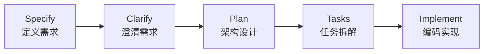
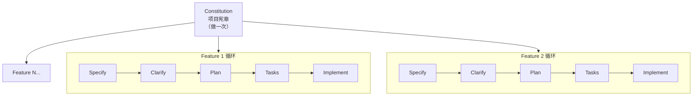
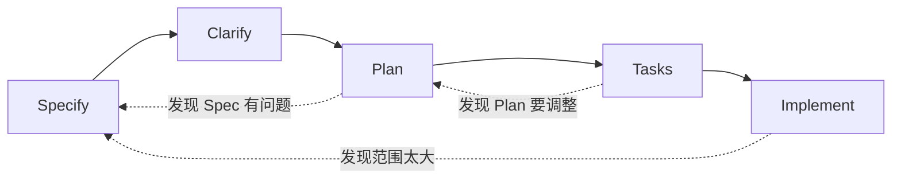

# 第三章：SDD 概述

## 3.1 引言

**本章目标**：理解 SDD（规范驱动开发）的全貌，建立对规范驱动开发的整体认知。

前两章我们学会了两个基本功：
- **CRC**：如何向 AI 清晰表达一个需求
- **多轮对话**：如何和 AI 持续协作解决问题

这两个技能是通用的——不管你是写商业计划书、做市场分析，还是写代码，都用得上。

**从这一章开始，我们把这些技巧应用到软件开发中。**

会写提示词、会和 AI 对话，足以应对日常小任务——写个函数、改个 bug、查个问题。但如果你要用 AI 做一个**完整的功能或项目**呢？比如从零开发一个 Todo 应用——有需求分析、架构设计、编码、测试……这时候光会"写提示词"不够了，你需要一套**方法论**来组织这些工作。

SDD（Specification-Driven Development，规范驱动开发）就是这样一套方法论。

不过在介绍它之前，让我们先看看没有方法论的时候，会发生什么。

---

## 3.2 从 Vibe Coding 说起

### 一个典型的翻车现场

很多人第一次用 AI 做项目，大概是这样的：

```
你："帮我写一个 Todo API"
→ AI 刷刷刷输出一大段代码
→ 跑不起来，改
→ 改完发现数据库设计不对，重来
→ 重来后发现认证没考虑，再加
→ 加完后代码已经乱成一团
→ 最后花的时间比自己写还多
```

这种做法有个名字——**Vibe Coding**（氛围编程）。这个概念来自 Andrej Karpathy 的一条推文，他描述的是一种完全"凭感觉"的 AI 编程方式：不看代码、不做设计，就是不断让 AI 生成，能跑就行。

Vibe Coding 不是一种方法论，它更像是"没有方法论"——想到什么说什么，AI 输出什么就用什么。

### 问题出在哪？

我们来具体看看，当你直接说"帮我写一个 Todo API"的时候，会遇到什么问题：

**需求不清**。Todo 的字段有哪些？标题必填吗？有没有截止日期？支不支持分类？这些你都没说，AI 只能猜。它猜的大概率不是你想要的。

**架构混乱**。要不要认证？用什么数据库？代码怎么组织？AI 会做一系列默认选择，但这些选择之间可能互相矛盾——比如它用了 SQLite 但设计了分布式方案，或者加了 JWT 认证但没考虑 token 刷新。

**反复返工**。因为前面没想清楚，你不得不一次次修改。每次修改都可能引入新的不一致，最后代码变成一团缝缝补补的意大利面。

**问题的本质是：你跳过了思考，直接进入了编码。**

这在没有 AI 的时候也会出现。区别在于，AI 让"跳过思考"变得太容易了——以前你至少得自己写代码，写着写着会意识到"这里没想清楚"。现在 AI 刷一下就给你一大段代码，你甚至没有"被迫思考"的机会。

### AI 擅长什么，不擅长什么

理解这一点至关重要：

| AI 擅长的 | AI 不擅长的 |
|-----------|------------|
| 根据明确需求生成代码 | 理解你脑子里模糊的想法 |
| 给出技术方案的选项 | 替你做业务决策 |
| 审查代码、找 bug | 判断产品方向对不对 |
| 生成测试用例 | 理解你团队的特殊约束 |
| 快速实现已知方案 | 权衡取舍并拍板决定 |

**一句话总结：AI 是优秀的执行者，但不是决策者。**

Vibe Coding 的核心问题就在于，它把决策也甩给了 AI。而 AI 最不擅长的恰恰就是决策——它不知道你的业务场景、不了解你的团队约束、不清楚你的优先级。

那什么才是正确的姿势？答案是：**你来决策，AI 来执行。而且决策要在编码之前完成，形成明确的规范文档。**

这就是 SDD 的核心思路。

---

## 3.3 什么是 SDD（规范驱动开发）

### 核心理念

SDD，全称 Specification-Driven Development（规范驱动开发），核心理念就三句话：

1. **规范先行**：先写规范，再写代码。代码是规范的产物，不是凭空冒出来的。
2. **分阶段推进**：把开发过程拆成明确的阶段，每个阶段有具体的产出物。
3. **人决策，AI 执行**：你负责思考和拍板，AI 负责按照你的规范生成代码。

这里最关键的概念是**规范是"单一真相源"（Single Source of Truth）**。

什么意思？就是整个项目中，规范文档是唯一权威的参考。代码应该忠实地反映规范，如果代码和规范不一致，那是代码的问题，不是规范的问题。规范不是"写完就丢"的东西，它贯穿整个开发过程，是你验证代码正确性的标尺。

你可以把它想象成盖房子：规范就是图纸，代码就是砖瓦。没有人会不看图纸就开始砌墙，但很多人在用 AI 编程的时候，恰恰就在干这件事。

### SDD vs Vibe Coding

把两者放在一起比较，区别就很明显了：

| 维度 | Vibe Coding | SDD |
|------|------------|-----|
| 起点 | 模糊的提示词 | 结构化的规范文档 |
| 过程 | 一次性生成，走一步看一步 | 分阶段推进，每步有明确产出 |
| 决策者 | AI（被动替你做选择） | 你（主动思考后拍板） |
| 验证方式 | 跑起来就行 | 对照规范持续验证 |
| 代码地位 | 唯一产物 | 规范的衍生物 |
| 返工频率 | 高（因为前期没想清楚） | 低（因为前期已经想清楚了） |
| 适合场景 | 快速原型、一次性脚本 | 生产项目、需要可维护性的项目 |

Vibe Coding 并不是一无是处——如果你就是快速验证个想法、写个一次性脚本，那完全没问题。但如果你在做一个需要上线、需要维护、需要和团队协作的项目，Vibe Coding 就会让你很痛苦。

SDD 就是为后者而生的。

---

## 3.4 关于本书 AI 产出示例的说明

从下一章开始，你会看到大量标注为"AI 产出示例"的内容。这些示例是为了展示每个 SDD 阶段的**预期产出形态**——也就是"写好了大概长什么样"。

有一点需要提前说明：**你用同样的提示词，得到的 AI 输出可能和书中不一样。**

这不是方法出了问题，而是 AI 的本质特点：

- **不同模型差异大**：GPT-4、Claude、Gemini 的风格和能力各不相同
- **同一模型每次输出不同**：即使同一个提示词，两次运行的结果也不会完全一样
- **上下文影响输出**：你之前的对话、项目中的其他文件，都会影响 AI 的产出

所以，正确的阅读姿势是：

1. **书中示例当参考**：理解每个阶段该产出什么样的内容、达到什么质量标准
2. **你的产出当实际**：不要追求和书中一模一样，关注的是结构完整、逻辑自洽
3. **审查是底线**：不管 AI 输出了什么，都必须经过你的审查。这也是每个章节都设置"审"环节的原因

---

## 3.5 SDD 完整流程

SDD 的流程分为两个层级：**项目级**和**功能级**。

### 项目级：Constitution（做一次）

每个项目开始时，先建立一份 **Constitution（项目宪章）**。它就像一个项目的"宪法"，定义了这个项目的基本规矩：

- 架构原则（分层架构、模块化……）
- 技术栈（Python + FastAPI？还是 Go + Gin？）
- 编码规范（命名规则、目录结构……）
- 安全策略（认证方式、数据保护……）
- 部署架构（容器化、CI/CD……）

Constitution **做一次，所有功能都遵守**。除非项目方向有重大调整，否则不需要改动。

### 功能级：Specify → Clarify → Plan → Tasks → Implement（每个功能循环一次）

每开发一个新功能（Feature），都走一遍这五个阶段：



**Specify（定义需求）**：写清楚这个功能要做什么。用户故事、功能需求、非功能需求、验收标准，全部写进规范文档。

**Clarify（澄清需求）**：规范的第一版一定有盲区。让 AI 帮你逐条审查，找出模糊的、遗漏的、有歧义的地方，逐一补充完善。

**Plan（架构设计）**：需求清楚了，开始设计怎么做。领域建模、数据模型、API 设计、目录结构——所有技术方案都在这一步确定。

**Tasks（任务拆解）**：把 Plan 拆成一个个具体的、可执行的开发任务。每个任务足够小，可以独立完成和验证。

**Implement（编码实现）**：按任务列表逐个实现。对每个任务，走"测试 → 实现 → 审查"的循环，确保代码质量。

### 完整流程一览

把项目级和功能级放在一起，SDD 的完整流程是这样的：



一个项目的开发节奏就是：先定 Constitution，然后一个 Feature 一个 Feature 地循环推进。

### 阶段回退：SDD 不是瀑布流

看到上面的流程图，你可能会觉得 SDD 是一条直线——从 Specify 到 Implement，一路走到底，不回头。

**不是这样的。**

实际开发中，你经常会在后面的阶段发现前面的问题：

- **Plan 阶段发现 Spec 有矛盾**：做领域建模时发现两条需求冲突了（比如"支持软删除"和"创建 Todo 时检查标题唯一性"——已删除的算不算？）。这时候要回到 Specify 补充澄清。
- **Tasks 阶段发现 Plan 不合理**：拆任务时发现某个 API 设计过于复杂，或者数据模型缺了个字段。这时候要回到 Plan 修改。
- **Implement 阶段发现 Spec 范围太大**：写着写着发现一个 Feature 其实该拆成两个。这时候要回到 Specify 拆分 Feature。

这些都是正常的——**发现问题然后回退修正，是 SDD 的能力，不是 SDD 的失败。**

更准确的流程图应该是这样的：



虚线箭头表示"回退路径"。**关键原则是：回退时先更新文档，再继续推进。** 不要在 Plan 没改的情况下继续 Tasks——那等于基于错误信息工作，后面只会错得更多。

回退不可怕，可怕的是不回退——硬着头皮往下走，最后实现出来的东西和需求对不上。SDD 的规范文档就是你的"检查点"，发现问题随时可以回溯。

---

## 3.6 项目级 vs 功能级

这两个层级经常让初学者困惑，所以单独拎出来讲讲。

### Constitution 是"定规矩"

Constitution 回答的是"这个项目怎么治理"的问题：

- 用什么技术栈？
- 代码怎么组织？
- 安全底线是什么？
- 怎么部署？

这些决定一旦做了，就不会因为某个具体功能而改变。你不会因为要加一个标签功能，就把数据库从 PostgreSQL 换成 MongoDB。

**Constitution 是长期稳定、普遍适用的规矩。**

### Specify → Implement 是"做事情"

功能级的五个阶段回答的是"这个功能怎么做"的问题：

- 这个功能的具体需求是什么？（Specify）
- 有没有遗漏？（Clarify）
- 技术上怎么实现？（Plan）
- 拆成哪些任务？（Tasks）
- 代码怎么写？（Implement）

每个功能都要走一遍，但不必每次都像第一次那么详细。简单功能可以快速过，复杂功能要仔细做。

### 它们的关系

一个简单的类比：

- Constitution 就像公司的规章制度——入职时定好，所有人遵守
- Specify → Implement 就像具体的项目任务——每个项目走一遍流程

Constitution 里定义的技术栈、架构原则、编码规范，在功能级的每个阶段都会被引用。比如你在 Plan 阶段做技术设计，必须符合 Constitution 里定义的架构原则；你在 Implement 阶段写代码，必须遵守 Constitution 里的编码规范。

**Constitution 约束功能级的每一步，确保整个项目的一致性。**

---

## 3.7 CRC 和多轮对话在 SDD 中的应用

前两章学的 CRC 和多轮对话技巧，在 SDD 中会被反复使用。它们不是独立的知识点，而是 SDD 的底层工具。

### CRC 贯穿所有阶段

SDD 的每个阶段都需要和 AI 对话，而每次对话的基本结构就是 CRC：

- **Specify 阶段**：用 CRC 向 AI 描述功能需求（Context：项目背景；Requirement：要做什么功能；Constraint：性能要求、兼容性要求等）
- **Plan 阶段**：用 CRC 向 AI 提出设计要求（Context：需求文档；Requirement：做技术设计；Constraint：必须使用 Constitution 指定的技术栈）
- **Implement 阶段**：用 CRC 向 AI 描述编码任务（Context：设计文档和任务列表；Requirement：实现某个具体任务；Constraint：遵循编码规范）

CRC 不是一个"阶段"，而是一个"工具"——你在 SDD 的任何阶段和 AI 对话，都在用 CRC。

### 多轮对话技巧的典型场景

第二章介绍的七种多轮对话技巧，在 SDD 的各个阶段各有用武之地：

| SDD 阶段 | 常用技巧 | 典型场景 |
|----------|---------|---------|
| Constitution | 方案对比 | 讨论技术选型——让 AI 列出 FastAPI vs Django 的优劣，你来拍板 |
| Specify | 苏格拉底式提问 | 完善需求——让 AI 反过来问你问题，帮你发现遗漏 |
| Clarify | 挑错与优化 | 查漏补缺——让 AI 审查你的规范，找出模糊和矛盾之处 |
| Plan | 角色扮演 | 架构审查——让 AI 扮演架构师，审查你的技术方案 |
| Implement | 少样本引导 | 代码风格统一——给 AI 看一段示例代码，让后续代码保持一致 |

你不需要刻意去"选用"哪个技巧——当你在某个阶段遇到具体问题时，自然会想到用哪种方式和 AI 对话。这些技巧在后续的实战章节中都会反复出现。

---

## 3.8 SDD 的文档结构

SDD 强调"规范先行"，那这些规范文档放在哪？怎么组织？

### `.spec/` 目录树

所有规范文档统一放在项目根目录的 `.spec/` 文件夹下：

```
project/
├── .spec/                              # SDD 规范文档根目录
│   ├── constitution.md                 # 项目宪章（项目级，唯一）
│   └── features/                       # 功能规范目录
│       ├── 001-todo-core/              # Feature 1
│       │   ├── spec.md                 #   Specify 阶段产出
│       │   ├── plan.md                 #   Plan 阶段产出
│       │   └── tasks.md               #   Tasks 阶段产出
│       └── 002-todo-tags/              # Feature 2
│           ├── spec.md
│           ├── plan.md
│           └── tasks.md
├── .cursor/rules/                      # AI 规则文件（从 Constitution 生成）
├── src/                                # 功能代码
└── tests/                              # 测试代码
```

### 这个结构的设计要点

**`.spec/` 作为根目录**。所有规范文档集中存放，与代码目录分离。这样做的好处是：规范文档不会和代码混在一起，找起来方便，管理也清晰。

**`constitution.md` 在顶层**。因为它是项目级的、唯一的，放在 `.spec/` 的根目录最直观。

**`features/` 按编号 + 名称组织**。每个功能一个文件夹，用数字编号保证顺序。`001-todo-core` 一看就知道是第一个功能、叫 todo-core。

**文件名严格对应 SDD 阶段**。`spec.md` 对应 Specify 阶段，`plan.md` 对应 Plan 阶段，`tasks.md` 对应 Tasks 阶段。不用猜哪个文件是什么，一目了然。

**没有单独的 Clarify 文件**。Clarify 的成果直接合并进 `spec.md`——澄清的目的就是完善规范，不需要单独存档。

**领域模型、数据模型、API 设计统一放在 `plan.md`**。不需要拆成多个文件，一个 `plan.md` 涵盖所有设计内容，查阅方便。

### 为什么要有结构化的文档管理

你可能会问："搞这么多文件，麻烦不麻烦？"

答案是：在 AI 编程时代，这些文件不只是给人看的，更是**给 AI 看的**。

**给 AI 提供上下文**。你在 Plan 阶段做技术设计时，可以把 `spec.md` 和 `constitution.md` 一起喂给 AI，它就能基于需求和项目规矩来设计方案。在 Implement 阶段写代码时，把 `plan.md` 和 `tasks.md` 给 AI 看，它就知道该实现什么、怎么实现。

**保持项目一致性**。有了这些文件，AI 在不同阶段、不同对话中产出的内容才能保持一致。没有文件，你每次都得重新口述背景，AI 每次的理解都可能不同。

**支持团队协作**。多个人协作开发时，文档就是团队的共同语言。新成员看完 `.spec/` 目录就能理解项目全貌。

**版本追踪**。这些文件可以放进 Git，每次修改都有记录。需求变了、设计改了，都能追溯。

**文档就是 AI 的记忆。** 你写得越清楚，AI 在后续每个阶段的输出质量就越高。

---

## 3.9 本书案例预告

从下一章开始，我们会用一个 **Todo 应用**作为贯穿全书的案例，完整走一遍 SDD 流程。

### 为什么选 Todo 应用？

Todo 应用是最经典的入门案例——简单到每个人都能理解需求，但又足够完整，能覆盖真实项目中的关键问题：CRUD 操作、用户认证、数据存储、权限控制、测试验证……

我们不会做一个"能跑就行"的 Todo，而是做一个**生产级质量**的 Todo——有清晰的架构、完善的测试、规范的代码。

### 案例安排

全书分两个 Feature 来演示：

**Feature 1：Todo 核心功能（第 4-7 章）**

完整走一遍 SDD 全流程：
- 第 4 章：建立 Constitution（项目宪章）
- 第 5 章：Specify & Clarify（定义和澄清 Todo 核心功能的需求）
- 第 6 章：Plan（领域建模、数据模型、API 设计）
- 第 7 章：Tasks & Implement（任务拆解、测试先行、编码实现）

核心功能包括：Todo 的增删改查（CRUD）、用户认证与授权、筛选和分页。

**Feature 2：增加标签功能（第 8 章）**

用一个小型需求演示 SDD 的迭代循环：
- Constitution 已经有了，直接从 Specify 开始
- 压缩版全流程演示，重点展示迭代的节奏
- 让读者感受到：第二个 Feature 比第一个快得多，因为"规矩"已经定好了

这样安排的目的是：**Feature 1 教你完整流程，Feature 2 让你感受真实的开发节奏。**

---

## 3.10 本章小结

**核心要点回顾：**

- **Vibe Coding 的问题**：跳过思考直接编码，导致需求不清、架构混乱、反复返工。AI 擅长执行不擅长决策，把决策甩给 AI 是错误的
- **SDD 的核心理念**：规范先行、分阶段推进、人决策 AI 执行。规范是单一真相源，代码是规范的产物
- **SDD 两个层级**：项目级的 Constitution（做一次定规矩）+ 功能级的 Specify → Clarify → Plan → Tasks → Implement（每个 Feature 循环一次）
- **CRC 和多轮对话**是 SDD 的底层工具，贯穿每个阶段
- **`.spec/` 目录**是规范文档的统一存放位置，结构清晰、与代码分离

### 实操环境建议

从下一章开始，每个 SDD 阶段都会给出提示词。你可能会问：**这些提示词在哪里执行？**

以 Cursor 为例，推荐的操作方式：

| SDD 阶段 | 建议 | 说明 |
|----------|------|------|
| Constitution | 新建对话 | 专门完成项目宪章，产出 `constitution.md` |
| Specify + Clarify | 同一个对话 | 它们是搭档——先写规范，接着澄清，最终产出 `spec.md` |
| Plan | 新建对话 | 通过 `@spec.md` 和 `@constitution.md` 引用已有文件 |
| Tasks | 可延续 Plan 的对话 | 也可以开新对话，引用 `@plan.md` |
| Implement | 每个 Task 新建对话 | 引用 `@tasks.md`、`@plan.md` 和相关源码文件 |

**经验法则：当对话超过 15-20 轮时，建议开新对话并带上关键文件引用，避免上下文丢失。**

其他 AI 助手（Claude Code、GitHub Copilot 等）的操作逻辑类似——核心是每个阶段的产出物保存为文件，下一个阶段引用上一个阶段的文件。

---

**下一章预告：**

从下一章开始，我们正式进入 SDD 的实战。首先是 **Constitution——项目宪章**。我们会为 Todo 应用建立一份完整的项目宪章，定义架构原则、技术栈、编码规范、安全策略和部署架构，为后续所有功能开发打下基础。
