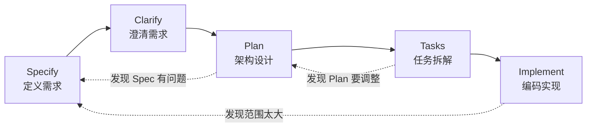

# 第三章：SDD 概述

## 3.1 引言

**本章目标**：建立对 SDD（规范驱动开发）的整体认知。

第 1 章和第 2 章我们掌握了 CRC 表达框架和多轮对话技巧。应对写函数、改 Bug 等日常小任务，这些技巧已足够。但要开发一个完整项目，光会“写提示词”远不够，你需要一套系统的方法论来组织代码。

SDD（Specification-Driven Development，规范驱动开发）就是这套方法论。

## 3.2 从 Vibe Coding 说起

直接让 AI “写一个 Todo API”往往会遭遇典型的翻车现场：AI 刷刷输出代码，跑不起来，改完发现数据库设计不对，再改发现漏了认证，最后代码乱成一团，耗时比自己写还多。

这种完全“凭感觉”的 AI 编程方式被称为 **Vibe Coding**（氛围编程）。它把决策权交给了 AI，而 AI 是优秀的执行者，却不是决策者。它不了解你的业务场景和约束。

正确的姿势是：**你来决策，AI 来执行。决策必须在编码前完成，并形成规范文档。**

## 3.3 什么是 SDD

SDD 的核心理念：
1. **规范先行**：先写规范，再写代码。
2. **分阶段推进**：把开发拆成明确的阶段，每阶段有具体产出。
3. **人决策，AI 执行**：你负责思考拍板，AI 按规范生成代码。

这里的关键是：**规范是“单一真相源”（Single Source of Truth）**。规范是整个项目中唯一权威的参考，代码必须忠实反映规范。就像盖房子，规范是图纸，代码是砖瓦，没有人会不看图纸就砌墙。

| 维度 | Vibe Coding | SDD |
|---|---|---|
| 起点 | 模糊的提示词 | 结构化的规范文档 |
| 过程 | 一次性生成，走一步看一步 | 分阶段推进，每步有明确产出 |
| 决策者 | AI（被动选择） | 你（主动拍板） |
| 验证方式 | 跑起来就行 | 对照规范持续验证 |
| 适合场景 | 一次性脚本 | 需要可维护性的生产项目 |

## 3.4 关于 AI 产出示例的说明

> **注意**：由于大模型存在随机性和上下文差异，你实际操作时得到的 AI 输出可能与本书示例不同。请将书中示例作为预期形态和质量标准的参考，重点关注结构完整与逻辑自洽，并始终保持人工审查。

## 3.5 SDD 完整流程

SDD 流程分为两个层级：**项目级**和**功能级**。

### 项目级：Constitution（做一次）

在项目开始时建立 **Constitution（项目宪章）**，定义架构原则、技术栈、编码规范和安全策略。它属于长期稳定的规矩，做一次即可对所有功能生效。

### 功能级（每个功能循环一次）

每开发一个新功能（Feature），依次走遍以下五个阶段：



- **Specify**：定义用户故事、功能与非功能需求、验收标准。
- **Clarify**：让 AI 审查规范，找出遗漏和歧义并完善。
- **Plan**：完成领域建模、数据模型和 API 设计。
- **Tasks**：将架构设计拆解为具体的开发任务。
- **Implement**：按任务列表遵循测试先行原则进行编码。

SDD 并非瀑布流，发现问题随时回退修正（如虚线所示），原则是**先更新文档再继续推进**。

## 3.6 项目级 vs 功能级

- **Constitution 是“定规矩”**：确定技术栈和架构，长期稳定。
- **Specify → Implement 是“做事情”**：回答每个具体功能怎么实现。

Constitution 约束功能级的每一步，确保整个项目的一致性。

## 3.7 CRC 和多轮对话在 SDD 中的应用

第 1 章和第 2 章学的技巧是 SDD 的底层工具。每个阶段都需要用 CRC 向 AI 清晰表达上下文、需求和约束。多轮对话技巧（如方案对比、苏格拉底式提问、角色扮演）也会在各个阶段自然运用，辅助你完善规范和设计。

## 3.8 SDD 的文档结构

规范文档统一存放在项目根目录的 `.spec/` 文件夹下，作为 AI 的上下文记忆：

```text
project/
├── .spec/
│   ├── constitution.md                 # 项目宪章
│   └── features/
│       ├── 001-todo-core/              # Feature 1
│       │   ├── spec.md                 # Specify 产出
│       │   ├── plan.md                 # Plan 产出
│       │   └── tasks.md                # Tasks 产出
│       └── 002-todo-tags/              # Feature 2
├── .cursor/rules/                      # AI 规则文件
├── src/                                # 功能代码
└── tests/                              # 测试代码
```

## 3.9 本书案例预告

本书通过一个生产级质量的 Todo 应用贯穿后续章节：
- **Feature 1（第 4-7 章）**：核心功能（CRUD、认证授权），完整演示 SDD 全流程。
- **Feature 2（第 8 章）**：增加标签功能，演示高效的 SDD 迭代循环。

## 3.10 一剂心理建设

看完这些流程和规范，你可能会觉得“这也太重了吧？比我自己写代码还累”。

**请记住：在 SDD 流程中，除了拍板决策，所有长篇大论的 Markdown 文档、架构图和繁琐的测试代码，绝大多数都是 AI 帮你写的！** 

你的身份已经从“苦哈哈的打字员”升级成了“技术总监”。技术总监不需要一行行敲代码，但他必须把控方向、制定规矩、审核产出。刚开始你可能会觉得生疏，但只要坚持走完第一个 Feature，当你看到 AI 能够精准无误地生成大段高质量代码时，你会彻底爱上这种掌控感。

## 3.11 本章小结

**核心要点回顾：**
- **Vibe Coding 的问题**：把决策权甩给 AI 导致返工，AI 擅长执行而非决策。
- **SDD 的核心理念**：规范先行、分阶段推进、人决策 AI 执行。
- **SDD 两个层级**：项目级的 Constitution 定规矩，功能级的 Specify → Implement 抓落地。
- **规范是真相源**：代码必须忠实反映规范，发现问题先改文档。

> **提示**：实操时，建议在 Constitution、Plan 等独立阶段新建对话，通过 `@` 引用已有规范文件，避免单次对话过长丢失上下文。
