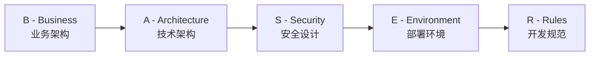
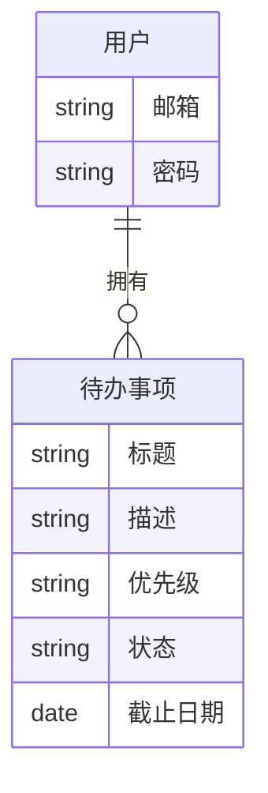
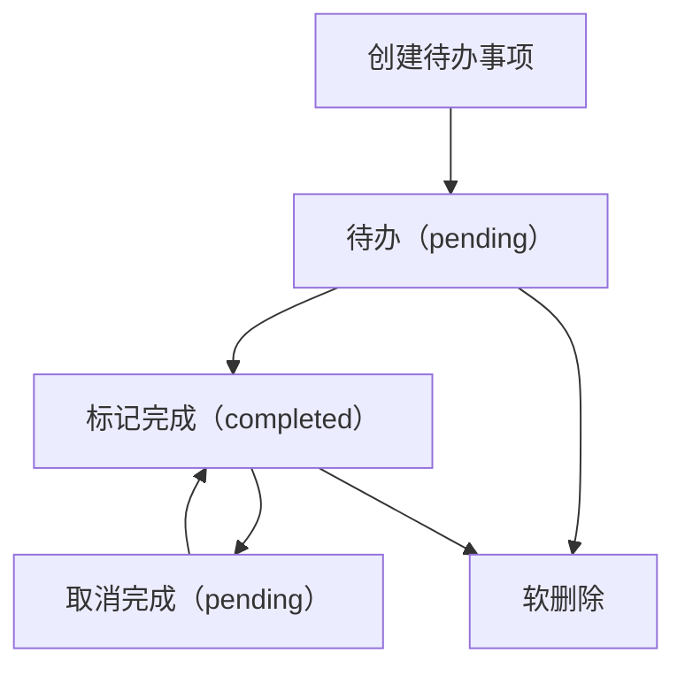
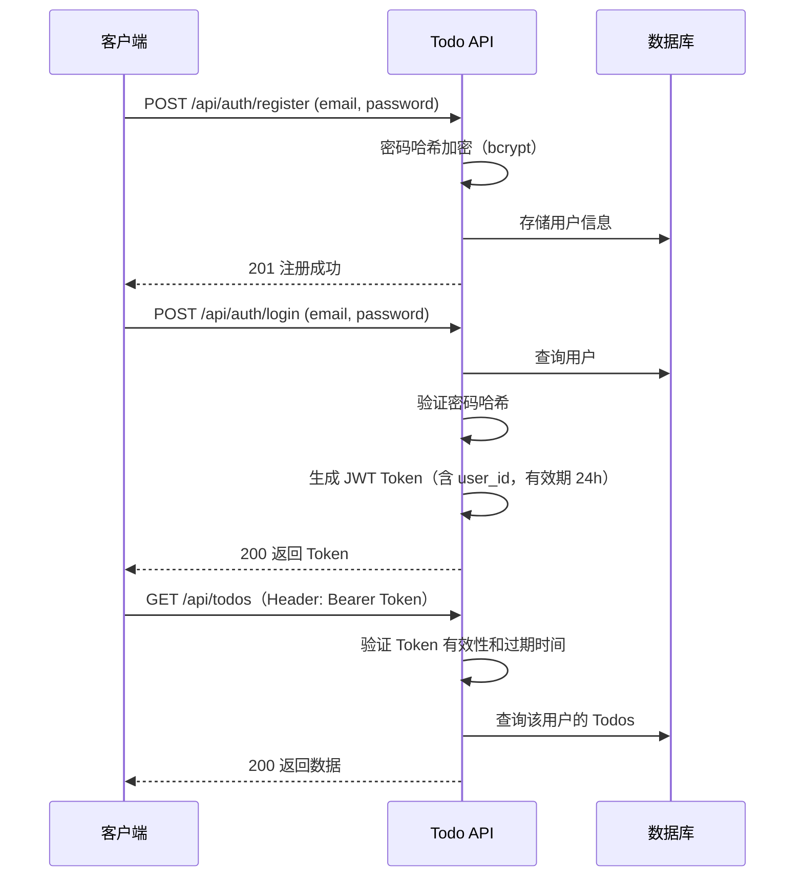

# 第五章：O - Outline（架构设计 - BASER 五要素）

## 5.1 引言

**本章目标**：学会用 BASER 五要素系统地进行架构设计，并让 AI 辅助完成设计文档。

上一章我们完成了需求文档。现在需求清楚了，接下来要回答一个问题：**系统该长什么样？怎么建造它？**

很多人在这一步会直接对 AI 说"帮我实现这个需求"——然后 AI 一次性输出几百行代码，目录结构混乱、设计随意、改起来费劲。

**问题不在 AI，在于你跳过了架构设计。**

Outline 阶段要做两件事：先**分析业务**（系统里有什么、怎么运转），再**设计技术方案**（用什么技术、怎么建造）。具体来说，要在写代码之前回答这些问题：
- 业务上有哪些核心对象和流程？
- 用什么技术来实现？
- 安全怎么保障？
- 怎么部署和运行？
- 代码怎么组织、遵循什么规范？

BASER 五要素就是这五个问题的结构化回答。

### BASER 的使用原则

**分步设计**：五个要素逐个完成，每完成一个就让 AI 审查。不要一次性让 AI 生成整个架构。

**灵活应用**：BASER 是完整的检查清单。简单项目（比如 Todo API）某些要素可以简化，但**思考过程不能跳过**——哪怕结论是"这个不需要"，你也要有意识地想过。

---

## 5.2 BASER 五要素概览



| 要素 | 一句话定义 | 核心产出 |
|------|-----------|---------|
| B | 业务上有什么？怎么运转？ | 领域对象图 + 业务流程 |
| A | 技术上怎么实现？ | 技术选型 + 数据模型 + 接口设计 |
| S | 安全上怎么保障？ | 认证授权方案 + 安全清单 |
| E | 怎么部署和运行？ | 容器配置 + 环境管理 |
| R | 代码怎么组织和规范？ | 规则文件（如 `.cursor/rules/`） |

**五个要素有先后关系**：业务架构决定技术架构，技术架构影响安全设计和部署方案，最后制定开发规范。

---

## 5.3 B - Business（业务架构）

### 这一步做什么

业务架构回答的问题是：**这个系统里有哪些"东西"？它们之间什么关系？怎么运转？**

具体来说：
1. **识别核心对象**：系统里有哪些核心概念（如用户、待办事项、分类）
2. **定义对象属性和关系**：每个对象有什么属性？对象之间怎么关联？
3. **梳理业务流程**：核心操作是怎么流转的？
4. **识别领域边界**（复杂系统）：哪些对象属于同一个业务领域？领域之间怎么交互？

对于 Todo 应用这样的简单系统，前三步就够了。但如果是复杂系统（如电商平台），第四步至关重要——它决定了系统拆分为哪些模块，每个模块再独立走 CODE 流程（详见第三章"复杂系统怎么用 CODE"）。

### Todo API 示例

**提示词：**

```
基于 @docs/requirements.md，帮我进行业务架构设计：
核心对象及属性、对象关系（Mermaid 图）、业务流程（Mermaid 流程图）、业务规则。
聚焦业务层面，不涉及技术实现（不要出现 id、时间戳、外键等技术字段）。
```

**AI 产出示例：**

**核心对象：**

| 对象 | 属性 | 说明 |
|------|------|------|
| 用户 | 邮箱、密码 | 系统的使用者，通过邮箱注册和登录 |
| 待办事项 | 标题、描述、优先级（高/中/低）、状态（未完成/已完成）、截止日期 | 用户创建和管理的任务 |

注意：这里只列**业务属性**——用户能感知到的东西。像"ID""创建时间""软删除标记"这些是技术实现细节，留到 A 阶段（技术架构）再考虑。

**对象关系：**



**核心业务流程（待办事项生命周期）：**



**关键业务规则：**

| 规则 | 说明 |
|------|------|
| 数据隔离 | 用户只能查看和操作自己的待办事项 |
| 状态可逆 | 已完成的事项可以取消完成，回到未完成状态 |
| 软删除 | 删除不销毁数据，已删除的事项不出现在列表中 |
| 优先级固定 | 优先级只能是高、中、低三个值 |

注意："软删除"在这里是**业务决策**——用户删除后数据可恢复，已删除的事项不再出现。至于具体怎么实现（用什么字段、怎么标记），那是 A 阶段（技术架构）的事。

业务规则会直接影响后续的技术设计：比如"数据隔离"意味着所有查询都要带用户过滤条件，"软删除"意味着需要一个删除标记字段。在 B 阶段先把规则提取出来，A 阶段才不会遗漏。

审查确认后，将业务架构保存为 `docs/business-architecture.md`。下一步的技术架构设计会引用它。

### 审查

完成业务架构后，让 AI 审查：

```
作为架构师，审查以上业务架构设计：
1. 核心业务实体是否遗漏？属性是否完整？
2. 实体关系是否合理？
3. 业务流程是否覆盖了需求文档中的所有功能？
4. 业务规则是否从需求文档中完整提取？
```

### 延伸阅读：领域驱动设计（DDD）

本节使用的方法——识别核心对象、定义关系、梳理流程——是领域建模的基础思路。如果你想更系统地学习，推荐了解 **DDD（Domain-Driven Design，领域驱动设计）**：

- **核心概念**：限界上下文、聚合根、实体、值对象、领域事件
- **推荐书籍**：Eric Evans《领域驱动设计》、Vaughn Vernon《实现领域驱动设计》
- **适用场景**：业务逻辑复杂、多团队协作的大型系统

对于 Todo API 这样的简单项目，轻量级建模足够了。但当你面对复杂业务时，DDD 提供了更强大的分析工具。B 步骤的领域分析也是复杂系统拆解的关键——把大系统拆成若干子域，然后对每个子域分别走 CODE 流程（详见第三章"复杂系统怎么用 CODE"）。

---

## 5.4 A - Architecture（技术架构）

### 这一步做什么

技术架构回答的问题是：**用什么技术来实现业务架构？**

具体包括：
1. **技术选型**：编程语言、框架、数据库
2. **部署策略**：B 阶段识别出的业务领域，在技术上如何组织？单体、模块化单体、还是微服务？
3. **数据模型**：数据库表结构设计（受技术选型影响）
4. **模块划分**：代码怎么分层？
5. **接口设计**：API 的具体定义

> **提示**：A 要素包含的内容较多。对于复杂项目，可以进一步拆分为"技术选型 → 数据模型 → 接口设计"三个子步骤，分别和 AI 对话。简单项目（如 Todo API）可以一步完成。

### Todo API 示例

**提示词：**

```
基于 @docs/business-architecture.md 的业务架构，帮我设计技术架构：
技术选型、部署策略、数据库表结构（含字段类型和索引）、目录结构、API 接口清单。
后端 Python，前端 Vue，初期用户量小，优先简单可维护。
```

**AI 产出示例：**

**1. 技术选型**

| 层面 | 选型 | 理由 |
|------|------|------|
| Web 框架 | FastAPI | 异步支持、自动生成 API 文档、类型校验 |
| 数据库 | PostgreSQL | 成熟稳定、支持丰富的数据类型 |
| ORM | SQLAlchemy 2.0 | Python 生态最成熟的 ORM |
| 认证 | PyJWT | 轻量、标准 JWT 实现 |
| 迁移工具 | Alembic | SQLAlchemy 配套迁移工具 |
| 前端框架 | Vue 3 + Composition API | 团队技术栈 |

**2. 部署策略**

采用**单体架构**。理由：
- 初期用户量小，无需分布式
- B 阶段只有两个业务对象（用户、待办事项），不需要拆分服务
- 降低部署和运维复杂度

**3. 数据库表结构**

B 阶段的核心对象直接映射为数据库表：User → `users` 表，Todo → `todos` 表。因为选择了关系型数据库（PostgreSQL），对象间的"拥有"关系通过外键（`user_id`）实现。如果当初选的是 KV 存储（如 Redis），数据模型会完全不同——这就是我们在 A 阶段才做数据模型设计的原因。

```sql
-- 用户表
CREATE TABLE users (
    id SERIAL PRIMARY KEY,
    email VARCHAR(255) UNIQUE NOT NULL,
    password_hash VARCHAR(255) NOT NULL,
    created_at TIMESTAMP DEFAULT NOW()
);

CREATE INDEX idx_users_email ON users(email);

-- 待办事项表
CREATE TABLE todos (
    id SERIAL PRIMARY KEY,
    title VARCHAR(100) NOT NULL,
    description TEXT,
    priority VARCHAR(10) NOT NULL DEFAULT 'medium',
    status VARCHAR(10) NOT NULL DEFAULT 'pending',
    due_date DATE,
    is_deleted BOOLEAN DEFAULT FALSE,
    created_at TIMESTAMP DEFAULT NOW(),
    updated_at TIMESTAMP DEFAULT NOW(),
    user_id INTEGER NOT NULL REFERENCES users(id)
);

CREATE INDEX idx_todos_user_id ON todos(user_id);
CREATE INDEX idx_todos_status ON todos(status);
CREATE INDEX idx_todos_priority ON todos(priority);
```

**4. 目录结构**

```
todo-api/
├── app/
│   ├── __init__.py
│   ├── main.py              # FastAPI 应用入口
│   ├── config.py             # 配置管理
│   ├── models/               # 领域模型（使用 SQLAlchemy ORM 映射）
│   │   ├── user.py
│   │   └── todo.py
│   ├── schemas/              # Pydantic 请求/响应模型
│   │   ├── user.py
│   │   └── todo.py
│   ├── routers/              # API 路由
│   │   ├── auth.py
│   │   └── todos.py
│   ├── services/             # 业务逻辑
│   │   ├── auth.py
│   │   └── todo.py
│   ├── dependencies/         # 依赖注入（认证等）
│   │   └── auth.py
│   └── database.py           # 数据库连接
├── docs/                     # 设计文档（CODE 各阶段产出）
│   ├── requirements.md       # C 阶段：需求文档
│   ├── business-architecture.md  # O-B：业务架构
│   ├── tech-architecture.md  # O-A：技术架构
│   └── security-design.md    # O-S：安全设计
├── tests/                    # 测试
├── alembic/                  # 数据库迁移
├── Dockerfile
├── docker-compose.yml
├── requirements.txt
└── .cursor/rules/            # 规则文件（Claude Code 中为 CLAUDE.md）
```

**5. API 接口清单**

| 方法 | 路径 | 说明 | 认证 |
|------|------|------|------|
| POST | /api/auth/register | 用户注册 | 不需要 |
| POST | /api/auth/login | 用户登录 | 不需要 |
| POST | /api/todos | 创建待办事项 | 需要 |
| GET | /api/todos | 查询待办事项列表 | 需要 |
| GET | /api/todos/{id} | 查询单个待办事项 | 需要 |
| PUT | /api/todos/{id} | 修改待办事项 | 需要 |
| DELETE | /api/todos/{id} | 删除待办事项（软删除） | 需要 |
| PATCH | /api/todos/{id}/complete | 标记完成/取消完成 | 需要 |

审查确认后，将技术架构保存为 `docs/tech-architecture.md`。安全设计和开发实现阶段都会引用它。

### 审查

```
作为架构师，审查以上技术架构设计：
1. 技术选型是否合理？有没有更好的选择？
2. 数据库索引是否够用？是否有多余？
3. 目录结构是否清晰？层次划分是否合理？
4. API 接口设计是否符合 RESTful 规范？
```

---

## 5.5 S - Security（安全设计）

### 这一步做什么

安全设计回答的问题是：**系统怎么防止被攻击、被滥用、被泄露？**

不需要成为安全专家，但至少要覆盖三个方面：
1. **认证授权**：谁能访问？能访问什么？
2. **数据保护**：敏感数据怎么存储？
3. **输入防护**：如何防止恶意输入？

### Todo API 示例

**提示词：**

```
基于 @docs/tech-architecture.md 的接口清单，设计安全方案：
JWT 认证流程（Mermaid 时序图）、数据保护措施、输入防护清单。
列出具体的安全清单，不要泛泛而谈。
```

**AI 产出示例：**

**1. JWT 认证流程**



**2. 数据保护措施**

| 数据 | 保护方式 |
|------|---------|
| 用户密码 | bcrypt 哈希存储，不可逆 |
| JWT Token | 设置过期时间（24 小时），使用 HS256 签名 |
| 用户数据隔离 | 所有查询自动附加 `user_id` 条件 |
| 敏感信息 | API 响应中不返回 password_hash |

**3. 输入防护清单**

| 攻击类型 | 防护措施 |
|---------|---------|
| SQL 注入 | 使用 ORM（SQLAlchemy），不拼接原生 SQL |
| XSS | API 返回 JSON，前端使用 Vue 模板自动转义 |
| 参数篡改 | 使用 Pydantic 严格校验请求参数类型和范围 |
| 越权访问 | 每个接口校验 `todo.user_id == current_user.id` |
| 暴力破解 | 登录接口增加频率限制（可选） |
| CORS | 配置允许的前端域名，限制跨域请求来源 |

> **注意**：本项目是 Vue + FastAPI 前后端分离架构，**必须配置 CORS**（跨域资源共享），否则前端无法调用后端 API。在 FastAPI 中通过 `CORSMiddleware` 配置，开发环境可允许 `localhost`，生产环境应限制为具体域名。

审查确认后，将安全设计保存为 `docs/security-design.md`。

---

## 5.6 E - Environment（部署环境）

### 这一步做什么

部署环境回答的问题是：**代码写完了，怎么跑起来？**

具体包括：
1. **容器化**：用 Docker 打包应用
2. **编排工具**：开发环境用 docker-compose
3. **配置管理**：环境变量、数据库连接等

### Todo API 示例

**提示词：**

```
为 Todo API（Python + FastAPI + PostgreSQL）设计开发环境部署方案：
Dockerfile、docker-compose.yml（API + 数据库）、环境变量清单。
环境变量不能硬编码在代码里。
```

**AI 产出示例（关键部分）：**

**Dockerfile：**

```dockerfile
FROM python:3.11-slim

WORKDIR /app

COPY requirements.txt .
RUN pip install --no-cache-dir -r requirements.txt

COPY . .

CMD ["uvicorn", "app.main:app", "--host", "0.0.0.0", "--port", "8000", "--reload"]
```

**docker-compose.yml：**

```yaml
services:
  api:
    build: .
    ports:
      - "8000:8000"
    environment:
      - DATABASE_URL=postgresql://postgres:postgres@db:5432/todo
      - JWT_SECRET=${JWT_SECRET}
      - JWT_EXPIRE_HOURS=24
    depends_on:
      - db
    volumes:
      - .:/app

  db:
    image: postgres:15
    environment:
      - POSTGRES_DB=todo
      - POSTGRES_USER=postgres
      - POSTGRES_PASSWORD=postgres
    ports:
      - "5432:5432"
    volumes:
      - pgdata:/var/lib/postgresql/data

volumes:
  pgdata:
```

**环境变量清单：**

| 变量名 | 说明 | 开发环境默认值 |
|--------|------|--------------|
| DATABASE_URL | 数据库连接字符串 | postgresql://postgres:postgres@db:5432/todo |
| JWT_SECRET | JWT 签名密钥 | 开发环境随机值，生产环境必须设置 |
| JWT_EXPIRE_HOURS | Token 有效期（小时） | 24 |

**关于生产环境：** 生产环境通常使用 k8s 部署，需要额外考虑：健康检查、资源限制、日志采集、密钥管理（如 k8s Secrets）、多副本负载均衡等。本示例聚焦开发环境，生产部署方案可在实际项目中根据运维需求另行设计。

审查确认后，将 `Dockerfile` 和 `docker-compose.yml` 保存到项目根目录。

---

## 5.7 R - Rules（开发规范）

### 这一步做什么

开发规范回答的问题是：**代码怎么写才统一、可维护？**

这一步的特殊之处在于：产出物不仅是文档，还要**固化为规则文件**。规则文件是 AI 编程工具的一个通用概念——你把项目规范写进去，AI 在后续每次对话中都会自动读取并遵循，不需要每次都重复说。在 Cursor 中放在 `.cursor/rules/` 目录下，在 Claude Code 中叫 `CLAUDE.md`（详见前言的工具映射表）。本书统一称为"规则文件"。

### Todo API 示例

**提示词：**

```
为本项目生成规则文件。技术栈：Python FastAPI + Vue 3，目录结构见 @docs/tech-architecture.md。
包含：编码风格、设计原则（SOLID/Clean Code）、分层规范、错误处理、日志规范。
规则要具体可执行，不要写"保持代码质量"这种空话。
```

**AI 产出示例（规则文件）：**

```
# Todo API 项目开发规范

## Python 后端规范

### 编码风格
- 遵循 PEP 8 规范
- 所有函数和方法必须包含类型注解
- 类和公共函数必须包含 docstring
- 单个函数不超过 30 行，超过则拆分
- 变量命名使用 snake_case，类命名使用 PascalCase

### 设计原则
- 遵循单一职责原则：每个模块/类/函数只做一件事
- routers 层只负责路由和参数校验，不包含业务逻辑
- services 层负责业务逻辑，通过依赖注入获取数据库 session，封装所有数据操作
- models 层负责领域模型定义（通过 SQLAlchemy 映射到数据库）
- schemas 层负责请求/响应的数据校验

### 错误处理
- 使用 FastAPI 的 HTTPException 返回错误
- 错误响应格式统一为：{"detail": "错误描述"}
- 业务错误使用 400，认证错误使用 401，权限错误使用 403，
  资源不存在使用 404
- 不允许裸 except，必须指定具体异常类型

### 日志规范
- 使用 Python 标准 logging 模块
- 关键业务操作记录 INFO 日志（如用户注册、创建 Todo）
- 异常记录 ERROR 日志，包含完整堆栈信息
- 不在日志中输出密码、Token 等敏感信息

## Vue 前端规范

### 编码风格
- 使用 <script setup> + TypeScript
- 组件命名使用 PascalCase（如 CreateTodoForm.vue）
- 不使用 any 类型
- Props 和 Emits 必须定义类型

### 组件设计
- 单个组件不超过 200 行，超过则拆分
- 组件职责单一：一个组件只做一件事
- 业务逻辑抽取到 composables 中，组件只负责 UI
```

### 规范的价值

这份规则文件放在项目中后（Cursor 中放在 `.cursor/rules/` 目录下，Claude Code 中命名为 `CLAUDE.md`），AI 在后续每一次对话中都会自动读取并遵循。你不需要每次都说"用 PEP 8"、"要有类型注解"——AI 会自动做到。

**开发规范不只是约束，更是效率工具。**

---

## 5.8 审查机制

每个要素完成后都要审查，这是 BASER 的核心原则之一。

### 审查提示词模板

```
作为资深架构师，审查以上 [业务架构/技术架构/安全设计/部署方案/开发规范]：
1. 是否有遗漏的关键点？
2. 是否有设计不合理的地方？
3. 是否与需求文档一致？
4. 有什么改进建议？
```

### 审查的关键：前后一致性

除了单个要素的审查，还要检查**要素之间的一致性**：

| 检查项 | 说明 |
|--------|------|
| B → A | 业务架构的每个对象，技术架构中都有对应的数据模型吗？ |
| A → S | 需要认证的接口，安全设计中都覆盖了吗？ |
| A → E | 技术架构的依赖（数据库、缓存），部署环境中都配置了吗？ |
| A → R | 技术架构的分层设计，开发规范中有对应的规则吗？ |

可以在五个要素都完成后，让 AI 做一次**整体一致性审查**：

```
请审查以下五份架构设计文档的一致性：
[@docs 目录下的 BASER 五份文档，或粘贴五个要素的产出]

检查：
1. 各文档之间是否有矛盾？
2. 业务架构的对象是否都映射到了技术架构的数据模型？
3. 安全设计是否覆盖了所有需要认证的接口？
4. 部署环境是否包含了所有技术依赖？
```

---

## 5.9 常见误区

### 误区 1：一句话完成整个架构设计

```
❌ "帮我设计 Todo API 的完整架构"
```

AI 会一次性输出几页内容，但每个方面都浅尝辄止。**分步设计，逐个深入，质量远高于一次性生成。**

### 误区 2：过度设计

Todo API 不需要微服务、不需要消息队列、不需要分布式缓存。**架构要匹配业务复杂度**，简单项目用简单架构。

判断标准：如果你需要花很多时间解释"为什么需要这个架构"，那大概率是过度设计了。

### 误区 3：跳过安全设计

"先把功能做完，安全以后再加。"——这是最常见的借口，也是最危险的。安全不是事后补丁，而是架构设计的一部分。事后加安全，改动量往往是提前设计的 3-5 倍。

---

## 5.10 练习题与本章小结

### 练习

**前置条件**：请先完成第四章练习中对应场景的需求澄清，用产出的需求文档作为本章练习的输入。如果还没做第四章练习，请先回到第四章完成。

选择以下任一场景，完成 BASER 五要素设计：

**场景 A**：用户反馈收集系统（提交反馈、查看列表、标记已处理、统计分析）

**场景 B**：API 访问日志系统（记录请求、查询日志、统计接口调用量）

要求：
1. 按 B → A → S → E → R 的顺序，逐个和 AI 对话
2. 每个要素完成后让 AI 审查
3. 五个要素都完成后，做一次整体一致性审查

### 本章小结

**核心要点回顾：**

- **B（业务架构）**：先理解业务——有什么对象、什么关系、怎么运转
- **A（技术架构）**：再做技术决策——用什么技术、怎么分层、接口怎么设计
- **S（安全设计）**：安全不是事后补丁——认证、授权、防护要提前想
- **E（部署环境）**：代码怎么跑起来——容器化、环境配置
- **R（开发规范）**：规范固化为规则文件，AI 自动遵循
- **分步设计 + 逐个审查**：不要一次性让 AI 生成全部，每个要素单独对话、单独审查
- **前后一致性检查**：五个要素之间不能有矛盾

**下一章预告：**

架构设计完成了，下一步开始写代码。第六章进入 **D - Develop（开发实现）**，学习用 STIR 四步法进行测试驱动开发。
