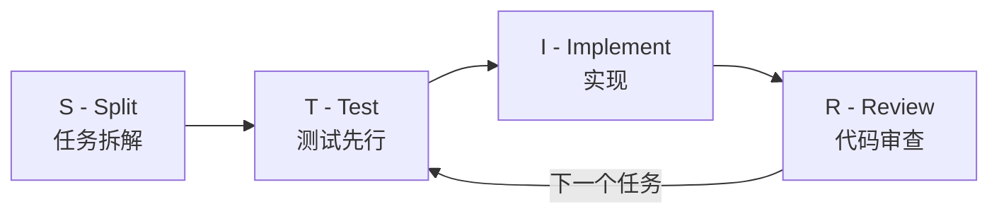
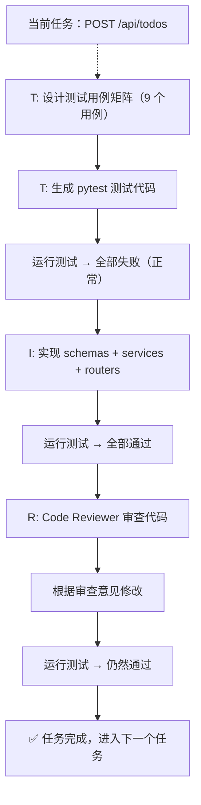

# 第六章：D - Develop（开发实现 - STIR 四步法）

## 6.1 引言

**本章目标**：学会用 STIR 四步法进行测试驱动开发。

上一章完成了 BASER 架构设计，产出了业务架构、技术架构、安全方案、部署配置和开发规范五份文档。现在终于可以写代码了。

但"写代码"不是打开编辑器就让 AI 开干。如果你直接说"帮我实现整个 Todo API"，AI 会一次性输出几百行代码——没有测试、没有审查、质量不可控。

**STIR 四步法的核心思路是：把大任务拆成小任务，每个小任务都走"测试 → 实现 → 审查"的循环。**

就像盖房子——不是一次性浇筑整栋楼，而是一层一层往上盖，每一层都验收合格再盖下一层。

---

## 6.2 STIR 四步法概览



**迭代模式**：先 S 拆解出所有任务，然后对**每个任务**依次走 T → I → R 循环。

| 步骤 | 做什么 | 产出 |
|------|--------|------|
| S | 把功能拆解成可独立开发的小任务 | 任务清单 + 开发顺序 |
| T | 为当前任务写测试用例和测试代码 | 测试代码（此时测试会失败） |
| I | 实现功能代码，让测试通过 | 功能代码 |
| R | 审查代码质量，重构优化 | 高质量的可测试代码 |

---

## 6.3 S - Split（任务拆解）

### 拆解依据

任务拆解不是凭感觉，而是**基于架构设计的产出物**：

- **B（业务架构）** 的领域对象 → 告诉你"有哪些功能模块"
- **A（技术架构）** 的模块划分和接口清单 → 告诉你"每个模块要实现什么"

### 两种拆解策略

| 策略 | 适用场景 | 开发顺序 |
|------|---------|---------|
| **自顶向下** | 简单 CRUD | API 路由 → Service 业务逻辑 → 数据库操作 |
| **自底向上** | 复杂业务逻辑 | 领域模型 → 领域服务 → 应用服务 → API |

**如何判断用哪种？** 简单标准：如果业务逻辑就是"接收数据、存数据库、返回结果"，用自顶向下；如果业务逻辑有复杂的状态流转、计算规则、多步骤流程，用自底向上。

Todo API 的 CRUD 操作属于简单场景，用自顶向下。

### Todo API 示例

**提示词：**

```
## Context
我要开始实现 Todo API。技术架构如下：
[@docs/tech-architecture.md 或粘贴第五章 A 阶段的接口清单和目录结构]

## Requirement
请帮我将开发工作拆解为独立的小任务：
1. 列出所有需要实现的任务
2. 确定开发顺序（考虑依赖关系）
3. 每个任务要足够小，可以在一次对话中完成

## Constraint
- 基础设施（数据库连接、项目配置）作为第一个任务
- 每个任务包含：路由 + 业务逻辑 + 数据库操作
- 标注任务之间的依赖关系
```

**AI 产出的任务清单：**

| 序号 | 任务 | 依赖 | 说明 |
|------|------|------|------|
| 1 | 项目基础设施 | 无 | 数据库连接、配置管理、项目结构搭建 |
| 2 | 用户注册 | 任务 1 | POST /api/auth/register |
| 3 | 用户登录 | 任务 2 | POST /api/auth/login（JWT 生成） |
| 4 | 认证中间件 | 任务 3 | JWT Token 验证的依赖注入 |
| 5 | 创建待办事项 | 任务 4 | POST /api/todos |
| 6 | 查询待办事项列表 | 任务 5 | GET /api/todos（分页、筛选） |
| 7 | 查询单个待办事项 | 任务 5 | GET /api/todos/{id} |
| 8 | 修改待办事项 | 任务 5 | PUT /api/todos/{id} |
| 9 | 删除待办事项 | 任务 5 | DELETE /api/todos/{id}（软删除） |
| 10 | 标记完成/取消完成 | 任务 5 | PATCH /api/todos/{id}/complete |

**开发顺序**：1 → 2 → 3 → 4 → 5 → 6 → 7 → 8 → 9 → 10

以上是后端 API 的任务清单。前端（Vue）的开发同样遵循 STIR 流程，拆解方式示例：

| 序号 | 任务 | 依赖 | 说明 |
|------|------|------|------|
| F1 | 项目脚手架 | 无 | Vue 3 + TypeScript + Element Plus 初始化 |
| F2 | 登录/注册页 | F1 | 表单校验、调用 auth API、Token 存储 |
| F3 | 待办列表页 | F2 | 分页、筛选、调用 todos API |
| F4 | 创建待办表单 | F3 | 表单组件、提交后刷新列表 |
| F5 | 编辑/删除/完成 | F3 | 行内操作、确认弹窗 |

每个前端任务同样走 T → I → R 循环（T 阶段使用 Vitest + Vue Test Utils 编写组件测试）。

拆解完成后，每个任务都足够小（一个接口或一个页面），可以在一次对话中完成 T → I → R 循环。

将任务清单保存为 `docs/tasks.md`，后续开发过程中可以用它跟踪进度。

### 启动项目与基础任务（任务 1-4）

任务拆解完成后，在进入详细的 T→I→R 演示之前，先快速搭建项目基础设施。以下基础任务以简略方式呈现，完整的 T→I→R 循环在下面几节以任务 5 为例展开。

#### 任务 1：项目基础设施

这是整个项目的"地基"——创建项目骨架、配置数据库连接、搭建测试基础设施。这个任务比较特殊，主要是搭建环境，后续任务才开始标准的 T → I → R 循环。

**提示词：**

```
## Context
我在开发 Todo API，技术架构设计如下：
[@docs/tech-architecture.md 或粘贴技术架构文档]

## Requirement
请帮我初始化项目：
1. requirements.txt（含所有依赖和版本号）
2. app/config.py（从环境变量读取配置）
3. app/database.py（SQLAlchemy 数据库连接和 Base 模型）
4. app/main.py（FastAPI 应用入口）
5. tests/conftest.py（测试基础设施：测试数据库、AsyncClient fixture、认证 fixture）

## Constraint
- 测试使用 SQLite 测试数据库，和生产环境隔离
- 每个测试前后自动创建和清理数据表
- conftest.py 要提供 client（AsyncClient）和 auth_token 两个 fixture
```

> **实战简化版：**
>
> ```
> 基于 @docs/tech-architecture.md 初始化项目。
> 生成 requirements.txt、config.py、database.py、main.py、tests/conftest.py。
> 测试用 SQLite，提供 client 和 auth_token fixture。
> ```

**关键产出：tests/conftest.py**

后续所有任务的测试都依赖这个文件，它是最重要的基础设施：

```python
import pytest
import pytest_asyncio
from httpx import AsyncClient, ASGITransport
from sqlalchemy import create_engine
from sqlalchemy.orm import sessionmaker

from app.main import app
from app.database import Base, get_db

# 使用 SQLite 测试数据库，和生产环境完全隔离
SQLALCHEMY_TEST_DATABASE_URL = "sqlite:///./test.db"
engine = create_engine(
    SQLALCHEMY_TEST_DATABASE_URL,
    connect_args={"check_same_thread": False},
)
TestingSessionLocal = sessionmaker(bind=engine)


def override_get_db():
    """替换生产数据库连接为测试数据库"""
    db = TestingSessionLocal()
    try:
        yield db
    finally:
        db.close()


app.dependency_overrides[get_db] = override_get_db


@pytest.fixture(autouse=True)
def setup_database():
    """每个测试前创建所有表，测试后清理"""
    Base.metadata.create_all(bind=engine)
    yield
    Base.metadata.drop_all(bind=engine)


@pytest_asyncio.fixture
async def client():
    """异步测试客户端"""
    async with AsyncClient(
        transport=ASGITransport(app=app), base_url="http://test"
    ) as c:
        yield c


@pytest_asyncio.fixture
async def auth_token(client: AsyncClient):
    """注册测试用户并登录，返回 JWT Token"""
    await client.post(
        "/api/auth/register",
        json={"email": "test@example.com", "password": "TestPass123"},
    )
    response = await client.post(
        "/api/auth/login",
        json={"email": "test@example.com", "password": "TestPass123"},
    )
    return response.json()["token"]
```

这段代码做了三件事：
1. **测试数据库隔离**：用 SQLite 替代 PostgreSQL，每个测试自动建表和清表，互不干扰
2. **`client` fixture**：提供 httpx 的 `AsyncClient`，可以像真实客户端一样向 FastAPI 发请求
3. **`auth_token` fixture**：自动注册并登录测试用户，返回 JWT Token——后续测试直接用它访问需要认证的接口

> 注意：`auth_token` fixture 依赖任务 2-3（注册和登录接口）。在完成任务 3 之后，需要认证的测试才能跑通。

#### 任务 2-4：用户认证

任务 2（用户注册）、3（用户登录）、4（认证中间件）走标准的 STIR 循环，和后面演示的任务 5 流程一致。这里给出每个任务的关键提示词：

**任务 2 - 用户注册（T 阶段）：**
```
为 POST /api/auth/register 编写 pytest 测试。
测试场景：正常注册、重复邮箱注册、密码为空。
需求见 @docs/requirements.md，规范见规则文件。
```

**任务 3 - 用户登录（T 阶段）：**
```
为 POST /api/auth/login 编写 pytest 测试。
测试场景：正常登录、密码错误、用户不存在。
需求见 @docs/requirements.md，规范见规则文件。
```

**任务 4 - 认证中间件（T 阶段）：**
```
为 JWT 认证中间件编写 pytest 测试。
测试场景：有效 Token、过期 Token、无 Token、格式错误的 Token。
安全设计见 @docs/security-design.md。
```

每个任务都是：写测试（T）→ 实现代码（I）→ 审查（R）→ 测试通过 → 下一个任务。

**完成任务 1-4 后，项目已经具备**：
- 可运行的项目骨架和配置（任务 1）
- 用户注册和登录接口（任务 2-3）
- JWT 认证中间件（任务 4）
- 完整的测试基础设施（conftest.py）

现在可以开始实现核心业务功能了。下面以**任务 5（创建待办事项）**为例，完整演示一次 STIR 的 T → I → R 循环。

---

## 6.4 T - Test（测试先行）

### 为什么先写测试？

很多人觉得"先写测试"是浪费时间。但在 AI 编程中，测试先行有三个独特的优势：

1. **测试是最精确的需求描述**——比自然语言更明确，AI 看到测试就知道你要什么
2. **测试是验收标准的代码化**——写完代码跑一下测试就知道对不对，不用人工逐项检查
3. **AI 写测试比人写测试快得多**——让 AI 做它擅长的事

### 测试即文档

好的测试代码本身就是一份**活的需求文档**。任何人读你的测试，都应该能理解这个功能"做了什么"和"不允许什么"。

所以对测试代码的**可读性要求甚至高于功能代码**：

| 要求 | 说明 | 示例 |
|------|------|------|
| **函数命名要讲故事** | 名字本身就能看出测试意图 | `test_create_todo_with_past_due_date_should_fail` |
| **docstring 描述预期** | 一句话说明"在什么条件下，预期什么结果" | `"""截止日期为过去的日期时，应返回 422"""` |
| **测试数据要有业务含义** | 不要用 "aaa"、"test123"，用真实的业务数据 | `title="完成项目报告"` 而不是 `title="test"` |
| **断言要具体** | 不只是检查状态码，还要验证返回值的关键字段 | `assert data["priority"] == "high"` |
| **一个测试只验一件事** | 不要在一个函数里塞多个场景 | 正常创建和空标题是两个测试函数 |

**反面示例：**

```python
# ❌ 看不出测试意图，数据无业务含义
async def test_1(client, token):
    r = await client.post("/api/todos", json={"title": "aaa"}, headers={"Authorization": f"Bearer {token}"})
    assert r.status_code == 201
```

**正面示例：**

```python
# ✅ 命名清晰、数据有含义、断言具体
async def test_create_todo_with_only_title_should_use_default_priority(
    client: AsyncClient, auth_token: str
):
    """只提交 title 时，priority 应默认为 medium"""
    response = await client.post(
        "/api/todos",
        json={"title": "整理会议纪要"},
        headers={"Authorization": f"Bearer {auth_token}"},
    )
    assert response.status_code == 201
    assert response.json()["priority"] == "medium"
```

一个月后你回来看这段测试，不需要看功能代码，就能知道"只传 title 时 priority 默认是 medium"。**这就是测试即文档的力量。**

### 测试用例矩阵

为每个任务设计测试用例时，覆盖三类场景：

| 场景类型 | 说明 | 示例 |
|---------|------|------|
| **正常场景** | 正确的输入，预期的输出 | 提交完整数据，成功创建 Todo |
| **边界条件** | 输入处于临界值 | title 长度恰好 100 个字符 |
| **异常场景** | 错误的输入或异常情况 | title 为空、未登录、操作他人数据 |

### Todo API 示例：为"创建待办事项"写测试

**提示词：**

```
## Context
我在开发 Todo API，使用 Python + FastAPI + PostgreSQL。
API 接口：POST /api/todos
请求体：{ title, description, priority, due_date }
认证方式：JWT Token（通过 Header 传递）

需求规则：
- title 必填，1-100 个字符
- description 可选，最大 500 字符
- priority 必填，可选值 high/medium/low，默认 medium
- due_date 可选，必须是未来日期
- 创建成功返回 201 和完整的 Todo 对象
- 未登录返回 401

项目开发规范：
[@.cursorrules 或粘贴规则文件中的测试相关规范]

## Requirement
为"创建待办事项"接口编写 pytest 测试代码：
1. 先列出测试用例矩阵（正常、边界、异常）
2. 再编写完整的测试代码

## Constraint
- 使用 pytest + httpx（FastAPI 推荐的异步测试客户端）
- 测试要能独立运行，使用测试数据库
- 每个测试函数只测一个场景
- 测试即文档：函数命名要能看出测试意图（如 test_create_todo_with_empty_title_should_fail）
- 每个测试函数必须有 docstring，描述测试条件和预期结果
- 测试数据使用有业务含义的值，不要用 "aaa"、"test123"
```

> **实战简化版（在 AI IDE 中）：**
>
> ```
> 为 POST /api/todos 编写 pytest 测试。
> 需求规则见 @docs/requirements.md，规范见规则文件。
> 先列测试用例矩阵，再写测试代码。
> 测试即文档：命名要清晰、数据要有业务含义。
> ```

**AI 产出示例：**

**测试用例矩阵：**

| 类型 | 测试用例 | 预期结果 |
|------|---------|---------|
| 正常 | 提交完整数据（title + description + priority + due_date） | 201，返回完整 Todo |
| 正常 | 只提交 title（其他用默认值） | 201，priority 为 medium |
| 边界 | title 长度恰好 1 个字符 | 201 |
| 边界 | title 长度恰好 100 个字符 | 201 |
| 异常 | title 为空字符串 | 422 |
| 异常 | title 超过 100 个字符 | 422 |
| 异常 | priority 为无效值（如 "urgent"） | 422 |
| 异常 | due_date 是过去的日期 | 422 |
| 异常 | 不带 Token 请求 | 401 |

**测试代码（关键部分）：**

```python
import pytest
from datetime import date, timedelta
from httpx import AsyncClient


@pytest.mark.asyncio
async def test_create_todo_with_full_data(client: AsyncClient, auth_token: str):
    """提交完整数据，成功创建待办事项"""
    response = await client.post(
        "/api/todos",
        json={
            "title": "完成项目报告",
            "description": "包含 Q1 数据分析",
            "priority": "high",
            "due_date": str(date.today() + timedelta(days=7)),
        },
        headers={"Authorization": f"Bearer {auth_token}"},
    )
    assert response.status_code == 201
    data = response.json()
    assert data["title"] == "完成项目报告"
    assert data["priority"] == "high"
    assert data["status"] == "pending"
    assert "id" in data


@pytest.mark.asyncio
async def test_create_todo_with_only_title(client: AsyncClient, auth_token: str):
    """只提交 title，其他字段使用默认值"""
    response = await client.post(
        "/api/todos",
        json={"title": "简单任务"},
        headers={"Authorization": f"Bearer {auth_token}"},
    )
    assert response.status_code == 201
    data = response.json()
    assert data["priority"] == "medium"
    assert data["description"] is None


@pytest.mark.asyncio
async def test_create_todo_with_empty_title(client: AsyncClient, auth_token: str):
    """title 为空，应返回 422"""
    response = await client.post(
        "/api/todos",
        json={"title": ""},
        headers={"Authorization": f"Bearer {auth_token}"},
    )
    assert response.status_code == 422


@pytest.mark.asyncio
async def test_create_todo_without_auth(client: AsyncClient):
    """不带 Token，应返回 401"""
    response = await client.post(
        "/api/todos",
        json={"title": "未认证请求"},
    )
    assert response.status_code == 401
```

> **关于测试中的 422 状态码**：你可能注意到测试用例矩阵中，校验失败的预期状态码是 422 而非需求文档中的 400（第五章规则文件也约定了"业务错误使用 400"）。这是因为 FastAPI 的 Pydantic 校验失败默认返回 422。这种"规范与框架默认行为"的冲突是**有意保留**的——在第七章（E 阶段），你会看到整体评估如何发现并处理这类问题。

此时运行测试，**所有测试都会失败**——因为还没有实现功能代码。这是正常的，接下来进入 I 阶段。

---

## 6.5 I - Implement（实现）

### 关键：把上下文给够

让 AI 实现功能代码时，最重要的是**把上下文给够**。需要给 AI 的信息：

1. **测试代码**（T 阶段产出）—— AI 看到测试就知道你要什么
2. **架构设计文档**（O 阶段产出）—— 目录结构、分层规范
3. **开发规范**（规则文件）—— 编码风格、错误处理规范

在 AI IDE 中，你可以通过文件引用功能直接引用这些文件，不需要手动粘贴。

### Todo API 示例：实现"创建待办事项"

**提示词：**

```
## Context
我在实现 Todo API 的"创建待办事项"功能。

相关文件：
- @tests/test_create_todo.py（测试代码）
- @app/models/todo.py（数据库模型，已实现）
- @app/dependencies/auth.py（认证中间件，已实现）
- @.cursorrules（规则文件，即开发规范）

目录结构参考第五章的架构设计。

## Requirement
请实现以下文件，让所有测试通过：
1. app/schemas/todo.py - 请求和响应的 Pydantic 模型
2. app/services/todo.py - 业务逻辑
3. app/routers/todos.py - API 路由

## Constraint
- 严格遵循规则文件中的开发规范
- routers 层只负责路由，业务逻辑放在 services 层
- 使用类型注解和 docstring
```

> 注：以上提示词使用 AI IDE 的文件引用语法（如 Cursor 的 `@`），可以直接引用项目中的文件。如果你的工具不支持此语法，手动粘贴相关文件内容即可。

> **实战简化版：**
>
> ```
> 实现"创建待办事项"功能，让 @tests/test_create_todo.py 的所有测试通过。
> 参考规则文件，routers 只负责路由，业务逻辑放 services 层。
> ```
>
> 在 AI IDE 中，AI 会自动读取引用的测试文件和规范，知道你要什么。

**AI 产出示例（关键部分）：**

**app/schemas/todo.py：**

```python
from datetime import date
from enum import Enum
from typing import Optional

from pydantic import BaseModel, Field, field_validator


class Priority(str, Enum):
    high = "high"
    medium = "medium"
    low = "low"


class CreateTodoRequest(BaseModel):
    """创建待办事项的请求模型"""
    title: str = Field(..., min_length=1, max_length=100)
    description: Optional[str] = Field(None, max_length=500)
    priority: Priority = Field(default=Priority.medium)
    due_date: Optional[date] = None

    @field_validator("due_date")
    @classmethod
    def due_date_must_be_future(cls, v: Optional[date]) -> Optional[date]:
        if v is not None and v <= date.today():
            raise ValueError("截止日期必须是未来的日期")
        return v


class TodoResponse(BaseModel):
    """待办事项的响应模型"""
    id: int
    title: str
    description: Optional[str]
    priority: str
    status: str
    due_date: Optional[date]
    created_at: str
```

**app/services/todo.py：**

```python
from sqlalchemy.orm import Session

from app.models.todo import Todo
from app.schemas.todo import CreateTodoRequest


def create_todo(db: Session, request: CreateTodoRequest, user_id: int) -> Todo:
    """创建待办事项"""
    todo = Todo(
        title=request.title,
        description=request.description,
        priority=request.priority.value,
        due_date=request.due_date,
        user_id=user_id,
    )
    db.add(todo)
    db.commit()
    db.refresh(todo)
    return todo
```

**app/routers/todos.py：**

```python
from fastapi import APIRouter, Depends, status
from sqlalchemy.orm import Session

from app.database import get_db
from app.dependencies.auth import get_current_user
from app.schemas.todo import CreateTodoRequest, TodoResponse
from app.services.todo import create_todo

router = APIRouter(prefix="/api/todos", tags=["todos"])


@router.post("", status_code=status.HTTP_201_CREATED, response_model=TodoResponse)
async def create(
    request: CreateTodoRequest,
    db: Session = Depends(get_db),
    current_user_id: int = Depends(get_current_user),
) -> TodoResponse:
    """创建待办事项"""
    todo = create_todo(db, request, current_user_id)
    return TodoResponse.model_validate(todo, from_attributes=True)
```

> **关于同步与异步**：你可能注意到测试用了 `AsyncClient`（异步），而 Service 层用了同步的 `Session`。这在 FastAPI 中完全正常——第五章选择 FastAPI 是因为它**支持**异步，但这不意味着所有层都必须用异步。FastAPI 的优势在于它同时兼容同步和异步代码，会自动将同步代码放到线程池执行。对于大多数项目，同步 SQLAlchemy 更简单直观。如果未来有高并发需求，可以切换到 SQLAlchemy 的异步模式。

实现完成后，运行测试：

```bash
pytest tests/test_create_todo.py -v
```

**所有测试通过** → 进入 R 阶段。如果有测试失败，先修复再继续。

---

## 6.6 R - Review（代码审查）

### 时机和定位

- **时机**：每个任务的 T → I 完成后立即进行
- **AI 角色**：Code Reviewer
- **目标**：检查代码质量，发现可以改进的地方

注意和 E 阶段（整体评估）的区别：
- **R 是模块级审查**：只看当前任务的代码（如"创建待办事项"）
- **E 是全局评估**：所有任务完成后，从功能、性能、安全等维度整体评估

### Todo API 示例：审查"创建待办事项"

**提示词：**

```
作为 Code Reviewer，审查以下"创建待办事项"功能的代码：
- @app/schemas/todo.py
- @app/services/todo.py
- @app/routers/todos.py

从以下维度给出具体改进建议：
1. 是否符合规则文件中的规范
2. 分层是否合理（routers/services/models 职责是否清晰）
3. 错误处理是否完善
4. 有没有代码坏味道或可以简化的地方
```

> **实战简化版：**
>
> ```
> 审查"创建待办事项"功能，检查：规范合规、分层合理性、错误处理、代码坏味道。
> 相关文件：@app/schemas/todo.py @app/services/todo.py @app/routers/todos.py
> ```

**AI 审查意见示例：**

> **问题 1：services 层缺少异常处理**
> `create_todo` 函数中 `db.commit()` 可能抛出数据库异常（如唯一约束冲突），但没有 try-except。建议捕获 `SQLAlchemyError` 并抛出明确的业务异常。
>
> **问题 2：TodoResponse 的 created_at 类型不够精确**
> `created_at: str` 应该改为 `created_at: datetime`，让 Pydantic 自动序列化，避免手动格式转换。
>
> **问题 3：建议补充**
> services 层的 `create_todo` 函数建议增加日志记录（符合规则文件中"关键业务操作记录 INFO 日志"的要求）。

**根据审查意见修改后，重新运行测试确保仍然通过：**

```bash
pytest tests/test_create_todo.py -v
```

测试通过 → 这个任务完成 → 进入下一个任务的 T → I → R 循环。

---

## 6.7 完整循环演示

以下是"创建待办事项"功能完整的 STIR 循环：



**整个过程中你做了什么？**

1. **决策**：确定测试用例要覆盖哪些场景
2. **判断**：审查意见中哪些要采纳，哪些不需要
3. **验收**：确认测试通过、代码质量达标

**AI 做了什么？**

1. **生成**：测试代码、功能代码
2. **审查**：发现代码问题
3. **修改**：根据你的指令修改代码

**人做决策，AI 做执行——STIR 的每一步都是这个模式。**

---

## 6.8 常见误区

### 误区 1：不拆解，直接让 AI 实现全部

```
❌ "帮我实现整个 Todo API 的所有接口"
```

AI 会一次性输出几百行代码，没有测试、没有审查、质量不可控。一旦有问题，很难定位是哪个接口出了错。

**拆解成小任务，每个任务单独实现，问题容易定位，质量可以控制。**

### 误区 2：跳过测试，直接实现

"测试以后再补吧。" ——然后就永远不补了。

在 AI 编程中跳过测试更危险：AI 生成的代码你不一定完全理解，没有测试就没有安全网。如果 AI 引入了一个隐藏 bug，你可能几周后才发现。

**测试先行不是浪费时间，而是最高效的质量保障。** AI 写测试很快，没有理由跳过。

### 误区 3：Review 只走形式

```
❌ "审查一下这段代码"
```

然后 AI 说"代码整体不错"，你就跳过了。

**有效的 Review 需要明确审查维度**（参考第二章的角色扮演技巧），并且要**认真对待 AI 的审查意见**——它提出的问题可能正是你忽略的。

---

## 6.9 练习题与本章小结

### 练习

**前置条件**：请先按照本章内容，完成任务 1-5 的开发。任务 1-4 可参考"启动项目与基础任务"中的提示词，任务 5 的完整 STIR 循环已在本章详细演示。

在此基础上，选择**任务 6（查询待办事项列表）**，独立完成一次 STIR 循环：

1. **T**：为 GET /api/todos 设计测试用例矩阵，涵盖分页、筛选、权限校验，生成测试代码
2. **I**：让 AI 实现功能代码，确保测试通过
3. **R**：让 AI 审查代码，根据意见修改，确认测试仍然通过

### 本章小结

**核心要点回顾：**

- **S（Split）**：大任务拆成小任务，基于架构设计的产出物来拆解
- **T（Test）**：先写测试——测试是最精确的需求描述，也是质量的安全网
- **I（Implement）**：把测试代码和架构文档一起给 AI，上下文越充分输出越好
- **R（Review）**：每个任务完成后立即审查，指定具体维度，认真对待审查意见
- **迭代模式**：S 拆解一次，T → I → R 循环 N 次，直到所有任务完成

**下一章预告：**

所有任务都开发完成后，进入 CODE 的最后一步——**E - Evaluate（整体评估）**，从功能、质量、性能、安全四个维度做全局检查。
