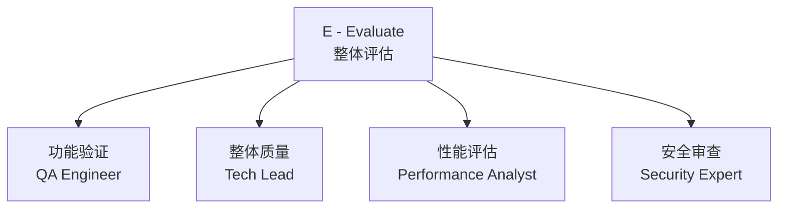

# 第七章：E - Evaluate（整体评估）

## 7.1 引言

**本章目标**：学会在所有开发任务完成后，对系统进行多维度的全局评估。

走到这一步，所有任务都已经完成了 STIR 循环——每个任务都有测试、有实现、经过了代码审查。系统能跑起来了。

但"能跑"和"能用"是两回事。

单个模块的审查（D 阶段的 R）关注的是代码级别的问题：命名、设计模式、代码坏味道。而**整体评估关注的是系统级别的问题**：

- 所有功能合在一起，是否满足了需求文档的每一条要求？
- 各模块集成后，有没有边界上的缝隙？
- 整体性能、安全性是否达标？

**E 阶段就是在上线之前，做一次全面的"出厂质检"。**

### E 和 D 的 R 的区别

| 维度 | D 的 R（代码审查） | E（整体评估） |
|------|-------------------|--------------|
| **时机** | 每个任务完成后 | 所有任务完成后 |
| **范围** | 单个模块的代码 | 整个系统 |
| **关注点** | 代码质量：可读性、设计、规范 | 系统质量：功能、性能、安全 |
| **AI 角色** | Code Reviewer | QA、安全专家、性能分析师 |
| **频率** | 每个任务一次 | 全部完成后一次 |

---

## 7.2 评估四维度

E 阶段从四个维度进行评估，每个维度由 AI 扮演不同的专家角色：



| 维度 | AI 角色 | 核心问题 |
|------|---------|---------|
| 功能验证 | QA Engineer | 需求文档的每条功能都实现了吗？ |
| 整体质量 | Tech Lead | 系统可维护吗？模块之间耦合度高吗？ |
| 性能评估 | Performance Analyst | 响应快吗？能扛住预期的并发吗？ |
| 安全审查 | Security Expert | 有认证漏洞吗？有注入风险吗？ |

四个维度可以**并行进行**，彼此不依赖。

---

## 7.3 实战演示：Todo API 整体评估

> **提示词简化说明：** 本章展示的是完整版提示词。实战中，在 AI IDE 里可以大幅简化——例如功能验证只需写：
>
> ```
> 作为 QA，对照 @docs/requirements.md 逐条验证 Todo API 功能是否完整实现，列出差异。
> ```
>
> 其他三个维度同理，核心是**指定角色 + 指定评估范围 + 引用文档**，不需要每次都罗列完整的约束条件。

### 维度 1：功能验证

**提示词：**

```
作为 QA Engineer，对 Todo API 进行功能验证。

需求文档的验收标准如下：
[@docs/requirements.md 或粘贴第四章需求文档的验收标准清单]

项目代码：
[@src 目录下的主要文件，或粘贴关键代码]

请逐条检查验收标准：
1. 每条标准是否已实现
2. 实现是否完整（有没有遗漏的边界条件）
3. 给出 通过/未通过/部分通过 的判定
```

**AI 产出示例：**

| 验收标准 | 判定 | 说明 |
|---------|------|------|
| 用户可以注册、登录，获取 JWT Token | ✅ 通过 | 注册和登录接口正常工作 |
| 未登录访问接口返回 401 | ✅ 通过 | 认证中间件已实现 |
| 创建待办事项，title 为空时返回 400 | ⚠️ 部分通过 | 返回的是 422（FastAPI 默认），需确认是否接受 |
| 列表查询支持分页 | ✅ 通过 | 支持 page 和 page_size 参数 |
| 可以按优先级和状态筛选 | ✅ 通过 | 支持 priority 和 status 查询参数 |
| 删除为软删除 | ✅ 通过 | is_deleted 标记，列表查询自动过滤 |
| 用户只能操作自己的数据，操作他人数据返回 403 | ⚠️ 部分通过 | 查询和修改有校验，但删除接口未校验 user_id |
| 密码不以明文存储 | ✅ 通过 | 使用 bcrypt 哈希 |
| API 响应时间 < 500ms | ❓ 未验证 | 需要实际压测，代码层面无明显性能问题 |

> **发现 2 个问题**：
> 1. 删除接口缺少 user_id 校验——**权限漏洞**，需要回到 D 修复
> 2. 错误码 422 vs 400 的差异——需要确认是否接受

### 维度 2：整体质量

**提示词：**

```
作为 Tech Lead，审查 Todo API 的整体代码质量。

请评估：
1. 模块之间的耦合度：routers/services/models 的职责是否清晰？有没有跨层调用？
2. 代码一致性：所有接口的错误处理、响应格式是否统一？
3. 可维护性：如果要新增一个"标签"功能，需要改动多少文件？改动是否集中？
4. 测试覆盖率：是否所有核心功能都有测试？有没有遗漏的场景？
```

**AI 产出示例：**

> **模块耦合度：良好**
> routers 只调用 services，services 只操作 models，分层清晰。没有发现 routers 直接操作数据库的情况。
>
> **代码一致性：有问题**
> 发现错误响应格式不统一：部分接口返回 `{"detail": "错误信息"}`，部分接口返回 `{"message": "错误信息"}`。建议统一为 `{"detail": "..."}`。
>
> **可维护性：良好**
> 新增"标签"功能预计需要：新增 models/tag.py、schemas/tag.py、services/tag.py、routers/tags.py，修改 Todo 模型增加关联。改动集中，不会影响现有功能。
>
> **测试覆盖率：需要补充**
> 认证相关（注册、登录）的边界测试较少，建议补充：重复邮箱注册、错误密码登录、Token 过期等场景。

### 维度 3：性能评估

**提示词：**

```
作为 Performance Analyst，评估 Todo API 的性能风险。

技术架构：Python + FastAPI + PostgreSQL（单体应用）
预期用户量：初期 < 100 用户

请分析：
1. 有没有明显的性能瓶颈（如 N+1 查询、未加索引的查询）？
2. 数据量增长后可能出现的问题
3. 改进建议（如果有的话）
```

**AI 产出示例：**

> **当前性能风险：低**
> 初期用户量小，当前架构足够支撑。
>
> **潜在问题 1：列表查询未做分页上限**
> page_size 参数没有最大值限制，用户可以传 page_size=10000，一次查询所有数据，可能导致内存和带宽问题。建议设置上限（如 max 100）。
>
> **潜在问题 2：软删除数据堆积**
> 软删除的数据不会被清理，随着时间推移 todos 表会越来越大。建议后期增加定期清理机制，或在查询中确保 `is_deleted=False` 走索引。
>
> **总体评估**：当前阶段无需优化，上述问题记录为技术债，后续关注。

### 维度 4：安全审查

**提示词：**

```
作为 Security Expert，对 Todo API 进行安全审查。

安全设计文档：
[@docs/security.md 或粘贴第五章 S 阶段的安全设计]

请检查：
1. 认证授权是否有漏洞
2. 输入验证是否完善
3. 敏感数据是否得到保护
4. 常见攻击（SQL 注入、XSS、CSRF）是否防范到位
```

**AI 产出示例：**

> **问题 1（高危）：删除接口未校验用户权限**
> DELETE /api/todos/{id} 没有检查 todo.user_id == current_user.id，任何登录用户都可以删除他人的待办事项。
>
> **问题 2（中危）：JWT Secret 硬编码风险**
> 检查 config.py 是否从环境变量读取 JWT_SECRET。如果有默认值，生产环境可能忘记替换。建议在启动时强制检查环境变量。
>
> **问题 3（低危）：缺少登录频率限制**
> 登录接口没有频率限制，存在暴力破解风险。初期可以接受，但建议加入 TODO 标记后续处理。
>
> **SQL 注入**：使用 SQLAlchemy ORM，风险低。✅
> **XSS**：纯 API 返回 JSON，Vue 模板自动转义，风险低。✅

### 汇总评估结果

四个维度评估完成后，汇总为一份改进清单：

| 编号 | 来源 | 问题 | 严重程度 | 处理方式 |
|------|------|------|---------|---------|
| 1 | 功能 + 安全 | 删除接口未校验 user_id | 高 | 立即修复（回到 D） |
| 2 | 质量 | 错误响应格式不统一 | 中 | 本轮修复 |
| 3 | 质量 | 认证相关测试不足 | 中 | 本轮补充 |
| 4 | 安全 | JWT Secret 硬编码风险 | 中 | 本轮修复 |
| 5 | 性能 | 分页 page_size 无上限 | 低 | 本轮修复 |
| 6 | 安全 | 登录无频率限制 | 低 | 记录为技术债 |
| 7 | 性能 | 软删除数据堆积 | 低 | 记录为技术债 |
| 8 | 功能 | 422 vs 400 错误码差异 | 低 | 确认后处理 |

> 关于第 8 条：FastAPI 的 Pydantic 校验默认返回 422，但需求文档写的是 400。这类"框架行为与需求预期"的差异，正是 E 阶段才容易发现的问题——因为你是在对照需求文档逐条检查，而不是只看代码本身。

将这份评估报告和改进清单保存为 `docs/evaluation.md`，作为后续修复和迭代的依据。

---

## 7.4 评估之后怎么办

### 按优先级处理

改进清单出来后，不是全部立刻修复。按优先级分三档处理：

1. **立即修复**（高危）：安全漏洞、功能缺失——回到 D 阶段，走 T→I→R 循环修复
2. **本轮修复**（中危）：质量问题、一致性问题——集中处理
3. **记录为技术债**（低危）：暂时不影响使用，后续迭代处理

### 回到 CODE 的前面环节

这就是第三章讲的"CODE 是迭代的"：

- 删除接口权限漏洞 → 回到 **D**，补测试、改代码、审查
- 如果发现需求理解有误 → 回到 **C**，重新澄清
- 如果发现架构设计有问题 → 回到 **O**，调整设计

### 什么时候算"完成"

**实际标准**：
1. 改进清单中所有"高危"和"中危"问题都已修复
2. 修复后重新运行所有测试，全部通过
3. "低危"问题已记录，有明确的后续处理计划

**不需要追求完美**。如果低危问题不影响核心功能和安全性，记录下来留给下一轮迭代即可。

---

## 7.5 常见误区

### 误区 1：觉得有了 STIR 的 R，就不需要 E

R 是"每块砖质量合格"，E 是"整栋房子验收"。单个模块没问题，不代表集成后没问题。

**典型的 E 才能发现的问题**：
- 接口之间的数据格式不一致
- 某个接口遗漏了权限校验（但其他接口都有）
- 整体测试覆盖率不够

### 误区 2：只做功能验证，跳过其他维度

功能能用 ≠ 系统合格。性能问题上线后才爆发、安全漏洞被攻击后才发现——到那时修复成本是现在的 10 倍。

**四个维度都过一遍，每个维度花 10 分钟，总共不到 1 小时。这是最值得花的时间。**

### 误区 3：评估完不行动

花了时间评估，列了一堆问题，然后因为"赶工期"不修复。那评估就白做了。

**至少把高危问题修掉。**

---

## 7.6 练习题与本章小结

### 练习

**前置条件**：请先完成第六章练习，实现任务 1-6。

假设你已经完成了 Todo API 的全部 10 个任务（任务 7-10 可参照任务 5-6 的模式自行完成），对整个系统进行四维度评估：

1. **功能验证**：对照 `docs/requirements.md`，逐条检查每个验收标准是否满足
2. **整体质量**：所有模块的分层是否一致？错误响应格式是否统一？
3. **性能评估**：查询有没有用到索引？分页有没有上限限制？
4. **安全审查**：所有接口都校验了用户权限吗？有没有遗漏的接口？

> **如果你没有完成全部 10 个任务**，也可以做缩小版练习：只对已完成的功能进行四维度评估。重点是体会评估的方法和思路，而非追求覆盖面。

### 本章小结

**核心要点回顾：**

- E 是**全局评估**，和 D 的 R（模块级审查）定位不同
- **四个维度**：功能验证、整体质量、性能评估、安全审查
- 每个维度用**不同的 AI 角色**：QA、Tech Lead、Performance Analyst、Security Expert
- 评估结果汇总为**改进清单**，按优先级分档处理
- 高危问题立即修复，低危问题记录为技术债
- **CODE 是迭代的**：E 发现问题后，回到 C/O/D 修复

**至此，CODE 方法论的四个阶段全部讲解完毕。**

回顾一下完整流程：
1. **C（Clarify）**：需求文档
2. **O（Outline）**：BASER 五份架构设计文档
3. **D（Develop）**：STIR 循环产出的测试代码 + 功能代码
4. **E（Evaluate）**：评估报告 + 改进清单

**下一章预告：**

CODE 方法论的四个阶段全部讲完了。但方法论是地图，不是路本身——实际走的时候，总会遇到地图上没标的岔路。下一章汇总一些**常见的岔路和应对经验**。
